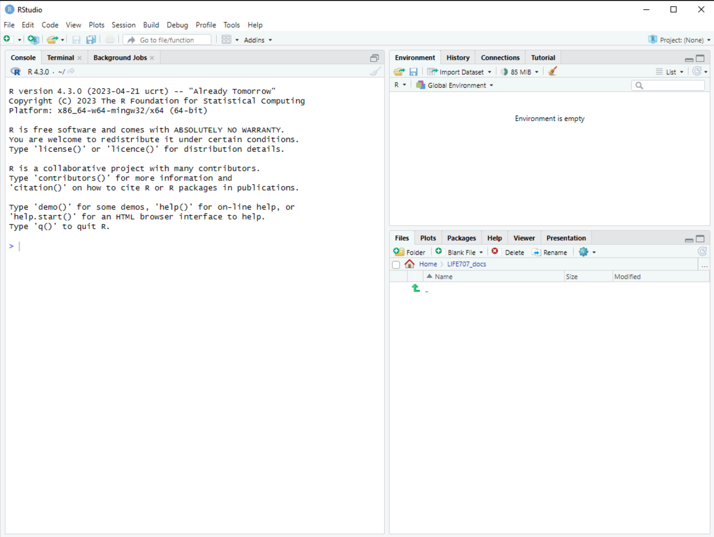
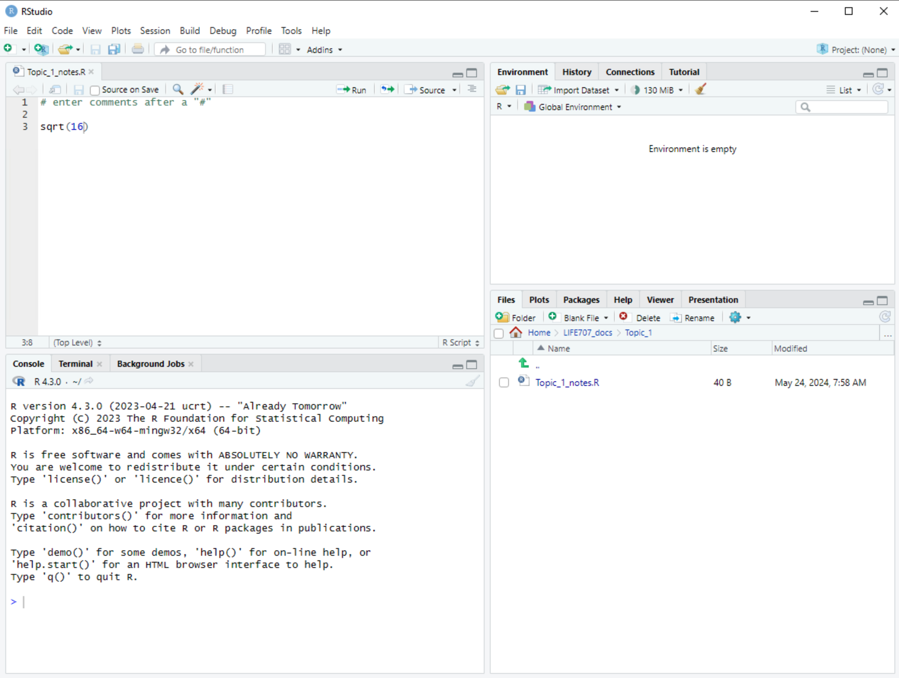
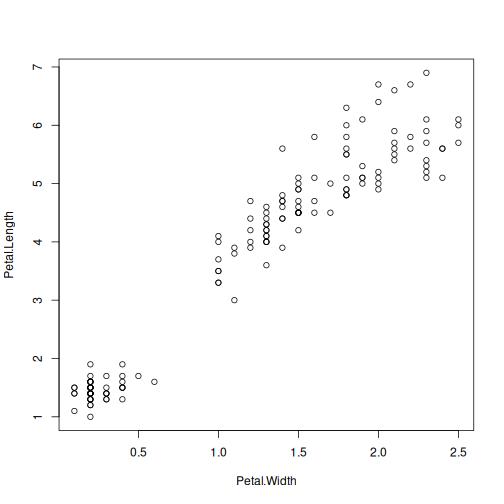
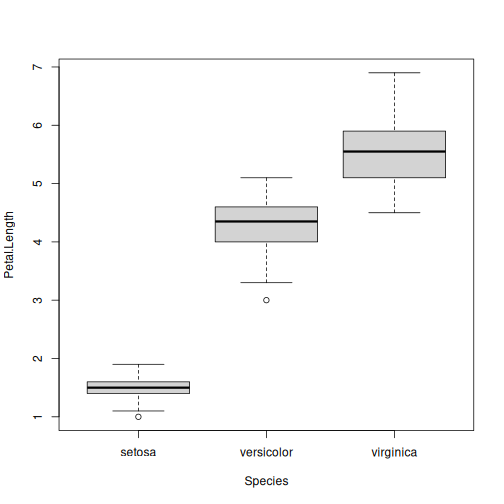

*Updated by Dr. Robert Treharne on 24 September 2026.*


In this topic you will be introduced to the R language and RStudio, to organising your files and to producing some simple plots.

:::{important}
Before you start Week 1, complete the [Onboarding](onboarding.md) chapter. It
will ensure that RStudio is ready to use and that you have created your
`LIFE707/Topic_1` folder.
:::

:::{tip} Video walkthroughs
If you get stuck or are not sure about the written material, the captioned
{ref}`Video Walkthroughs <video-walkthroughs>` at the end of this chapter are
a great way to improve your understanding. You may wish to bring wired
headphones to future workshops if you would like to listen to the audio.
:::

## Files for this week

Download these files into the `LIFE707/Topic_1` folder you create below. They
are included with this book, so you do not need to return to Canvas.

- <a href="/data/topic-1-getting-started/DissolvedO2.txt?download=1">DissolvedO2.txt</a>: the text data used in the reading-data example.
- <a href="/data/topic-1-getting-started/DissolvedO2.csv?download=1">DissolvedO2.csv</a>: the CSV version for the exercise.
- <a href="/data/topic-1-getting-started/spider.txt?download=1">spider.txt</a>: the spider-data exercise.

## Getting Started

Review the videos giving the background to R and RStudio and then open RStudio. If you're using a windows machine in the teaching labs, this can be found by searching for the R-Studio application. You should get a screen that looks like Figure 1.



We can either enter commands directly into the console pane or by creating a new file that we edit and run commands as we need them. The latter approach is better since if commands are in a file we're able to rerun them later or to edit them if they don't work the first time. Let's start by organising our files for this course sensibly. There's more than one way to do this, but it's important to have a system so that you can find what you've done easily. We're going to create a folder for all of your LIFE707 work, and then folders within this for each topic. (I'll use the terms *folder* and *directory* interchangeably).

Within the file pane on the bottom right of RStudio, pick a location that's accessible to you and create a folder called *LIFE707* using the 'new folder' icon. (If you don't see it appear, you may need to click on the refresh icon, which looks like a circular arrow). Then move into this folder by double clicking on it. Now create a folder called *Topic_1* and move into this. You can also create these folders outside RStudio if you prefer.

Now we'll create a new file. Go to the menu and click *File* \| *New File* \| *R Script*, and then save this as *Topic_1_notes.R* in the folder you've just created. Your RStudio environment should now look something like Figure \@ref(fig:RStudio-env-withfile).



Note, you don't have to have the same structure or file names that I use, but it really helps to have a system for this module and for your own data.

## Getting used to R

In the material here, grey boxes are code that can be entered into R and white boxes are the output you should see. Anything after a "\#" is a comment and ignored by R.

Let's start by working out the square root of 16. In the R script file in the top left of the console, type `sqrt(16)`. This is a simple command, but we haven't evaluated it yet. To do that we can either

1.  Copy and paste it into the console screen in the bottom left, or

2.  Click on the run icon to run that line of the R script.

(I usually do the latter to stop me from cutting and pasting by mistake and losing code by accident).


``` r
sqrt(16)
```

```
## [1] 4
```

It gives you the answer 4. Here the function `sqrt()` gives the square root and is applied to the object 16


``` r
y <- sqrt(16)
```

This time, you don't get an answer on the screen. Instead a new object, y, is created that is assigned ( `<-` ) the output of `sqrt(16)`. You should see this appear in the top right hand pane as a new object.

Type `y` into the console and it should return its value, 4.


``` r
y
```

```
## [1] 4
```

This is a very typical structure for a line of R code, where we apply a function to an object and save the result to a new object in the general form:

*new.object \<- function(object)*

Now set up a vector (a set of values, here the numbers 1 to 8). Enter the text below into your R script file and run both lines. The `c()` function just combines a set of values, separated by commas, to create a vector.


``` r
x <- c(1,2,3,4,5,6,7,8)
sqrt(x)
```

```
## [1] 1.000000 1.414214 1.732051 2.000000 2.236068 2.449490 2.645751 2.828427
```

Here x is a vector and the function acts on every element of the vector to produce another vector.

Let's move from square roots to logs, and couple more features of R along the way.

To get help on a function, you can type the name of the function into the help tab on the bottom right pane or type `?<function name>` in to the console. Try typing `?log` to see what it does.

Now try the following commands:


``` r
log(x=10) #a single value
```

```
## [1] 2.302585
```

``` r
log(10)   #if you don't specify x=... R will assume the first object it sees in the function is x
```

```
## [1] 2.302585
```

``` r
log(c(10,100))
```

```
## [1] 2.302585 4.605170
```

Here x is put in as either a single value, 10, or as a vector `c(10,100)` containing 10 and 100. But why is the log of 10 equal to 2.3? By default, it gives natural logs. To get logarithms in base 10, we need to add an extra *argument* to the `log()` function, `base=10`, as below:


``` r
log(c(10,100),base=10)
```

```
## [1] 1 2
```

A function will return an object that can be passed to another function. In `log(sqrt(16))`, for example, `sqrt(16)` is evaluated first, then the answer, 4, is passed to `log()` to give the natural log of 4.


``` r
log(sqrt(16))   #is the same as log(4)
log(sqrt(2*8))  #R works from the middle outwards, 2 x 8 = 16, sqrt of 16 = 4
log(2*8)/2      #If you remember how logs work, you'll see why these are equivalent
(log(2) + log(8))/2
```

Note that what's printed on the screen is given to a limited number of significant figures


``` r
exp(1.386294)
```

```
## [1] 3.999999
```

What's stored in the workspace is more accurate


``` r
y <- log(4)
exp(y)
```

```
## [1] 4
```

## Errors part 1/n

So far R has, hopefully, been well behaved. It is, though, inevitable that R will throw errors during this module. Don't panic when it does, you can only learn if you're making mistakes.

Some of these errors come when you try to give an object to a function that it can't handle. So far, we've dealt with positive real numbers (i.e. \>0). But we can have objects that are negative numbers, or not numbers at all. These may not make sense to some functions.

To see this, try typing


``` r
sqrt(16)
sqrt("sixteen")
sqrt(-16)
sqrt(c(-16,0,16))
```

`sqrt()` expects a numeric value, 16 is seen as a number, "sixteen" is seen as text so R gives an error. `sqrt()` will only output real, not imaginary, numbers and warns as it gives an output of 'not a number' (NaN) for `sqrt(-16)`. Try swapping `log` for `sqrt` and you should see something similar.

We'll pick up again on errors and how to approach debugging code later.

## Dataframes

So far we've dealt with simple scalar values (like `4`) and vectors (like `c(-16,0,16)`). Another very useful data structure is a dataframe. This can be thought of as similar to an Excel spreadsheet, with rows corresponding to different records (e.g. individuals or objects), and columns as different types of data collected on each. Much like in Excel, these columns (or 'fields') can be numeric, text string, date or other types of data.

Later on, we'll tackle how to read data into R, but to begin with we can use some in-built data that R uses as examples. One dataframe that is packaged up with R is on a set of iris species related to sepal length and various other measures. Although it comes packaged with R, we need to tell R that we're going to use it. The next section of code asks R to make the iris dataframe available using the function `data` and then uses `head` and `summary` to give the first few lines and a summary of the data. Take a minute to look at the output.


``` r
data(iris) #iris should now appear in the environment frame
head(iris) #prints first 6 lines
```

```
##   Sepal.Length Sepal.Width Petal.Length Petal.Width Species
## 1          5.1         3.5          1.4         0.2  setosa
## 2          4.9         3.0          1.4         0.2  setosa
## 3          4.7         3.2          1.3         0.2  setosa
## 4          4.6         3.1          1.5         0.2  setosa
## 5          5.0         3.6          1.4         0.2  setosa
## 6          5.4         3.9          1.7         0.4  setosa
```

``` r
summary(iris) #gives a summary of the data, including minimum and maximum values, mean and median, and 1st and 3rd quartiles
```

```
##   Sepal.Length    Sepal.Width     Petal.Length    Petal.Width   
##  Min.   :4.300   Min.   :2.000   Min.   :1.000   Min.   :0.100  
##  1st Qu.:5.100   1st Qu.:2.800   1st Qu.:1.600   1st Qu.:0.300  
##  Median :5.800   Median :3.000   Median :4.350   Median :1.300  
##  Mean   :5.843   Mean   :3.057   Mean   :3.758   Mean   :1.199  
##  3rd Qu.:6.400   3rd Qu.:3.300   3rd Qu.:5.100   3rd Qu.:1.800  
##  Max.   :7.900   Max.   :4.400   Max.   :6.900   Max.   :2.500  
##        Species  
##  setosa    :50  
##  versicolor:50  
##  virginica :50  
##                 
##                 
## 
```

Within RStudio, you also type `View(iris)` in the console and see the whole iris dataset in a viewer a bit like Excel.

## Simple plots

R is very good at letting you explore data. The `plot` function is pretty good at generating some simple graphs that let you plot pairs of variables against each other. Suppose we want to know whether there's a relationship between petal length and petal width in the iris dataset. We can use the following command. Here we are using a *formula* to define the variables (the names of the columns in iris) that we want to plot. `Petal.Length ~ Petal.Width` means that we want to plot Petal.Length against Petal.Width, i.e. width on the x-axis and length on the y-axis. The argument 'data' (`data=iris`) tells the plot function where Petal.Length and Petal.Width can be found. Note that all the variable names have to be spelt exactly right, including having a capital 'W', for example.


``` r
plot(Petal.Length ~ Petal.Width, data=iris)
```



This produces a scatter plot and not surprisingly, there's a clear, positive relationship between the width and length of petals.

Sometimes it's helpful to make sure that the plot includes the origin (i.e. x=0 and y=0). This can be done by specifying the range of the x- and y-axes using the arguments `xlim` and `ylim` to `plot()`. Try the following and see how it is different to the last plot and where the numbers come from. Feel free to experiment by putting different numbers into `xlim` and `ylim`.


``` r
plot(Petal.Length ~ Petal.Width, data=iris, xlim=c(0,3), ylim=c(0,7))
```

Let's try another type of plot. Here there are three species of iris. If you refer back to the `summary(iris)` command you see that (i) there are 50 records of each iris species and (ii) the Species variable is not continous like width or length, but is *categorical* (also called a *factor*) that takes one of three values, 'setosa', 'versicolor' or 'virginica'. If we want to plot Petal.Length against Species, we use the same form of formula as before, but R gives us a different kind of plot, called a boxplot (or a box-and-whiskers plot) that gives the median and range of the data.


``` r
plot(Petal.Length ~ Species, data=iris)
```



In later topics, we'll learn how to present data to a publication standard that clearly gives the information a reader needs, including putting units of measurement on the axes, colouring points, and more.

## Reading in data

R will read in text files. (It won't easily read in excel files directly.) We'll read in the data from <a href="/data/topic-1-getting-started/DissolvedO2.txt?download=1">DissolvedO2.txt</a>, which is data on dissolved oxygen through time from an experiment on different plant cultivars. Download it from the link and save it in the `LIFE707/Topic_1` directory you created at the start of this session. Outside of RStudio, it is also useful to open the file in a text editor like Notebook (for PCs) or TextEdit (for macs) to see what it looks like. Text files like this are much simpler than Word or Excel files and lack any extra formatting.

A common problem is for R to not find the file you want to read in. We need to tell it where to look, i.e. the LIFE707/Topic_1 directory. This is called the 'working directory'. From R-Studio, you can use the menu

*Session \| Set Working Directory \| Choose Directory...*

you can also use the command `setwd("/path/to/your/directory")` or navigate to the directory you want in the file pane and the 'More' tab has an option to set a working directory.

To check what directory you're in and the files in it you can use the code below.


``` r
getwd()   #should give the directory you expect
dir()     #should return list of files in your directory, including "DissolvedO2.txt"
```

Then read in <a href="/data/topic-1-getting-started/DissolvedO2.txt?download=1">DissolvedO2.txt</a>. The video below can help with importing data into R. This is where many of the error messages arise when students first try to use R and you may have to try a few times.

<div style="position: relative; width: 100%; aspect-ratio: 16 / 9; margin-bottom: 2rem;">
  <iframe src="https://liverpool.cloud.panopto.eu/Panopto/Pages/Embed.aspx?id=0c279e25-61b0-4f7b-abd8-b4cf00889ad8&amp;autoplay=false&amp;offerviewer=true&amp;showtitle=true&amp;showbrand=true&amp;captions=true&amp;interactivity=all" style="border: 1px solid #464646; position: absolute; top: 0; left: 0; width: 100%; height: 100%; box-sizing: border-box;" allowfullscreen allow="autoplay" aria-label="Panopto Embedded Video Player" aria-description="load_data-4c2e6914c577b7bee51ec2e908cb0d62"></iframe>
</div>


``` r
disox<-read.table("DissolvedO2.txt", header=TRUE) 
#The argument header=TRUE is used to say that the first row of the file has the names of the fields
```

If this works you just get a '\>' symbol and no red error text. A common error is *'No such file or directory'*. This can be because you've not set the directory, you've not put the file into the directory, or you've mis-typed the file name or command. Much of R is case sensitive.

You should now have a dataframe, which we've named 'disox', sitting in the workspace environment (which you can see on the top right pane or by typing `ls()`). Because R works on the dataframe sitting in the computer memory, not the hard drive, any changes to this dataframe won't change the original file.

Always check the file reads in as you expect it to.


``` r
head(disox)    #This prints the first few lines of data you've read in. 
summary(disox) #This gives some summary statistics. 
View(disox) #opens the dataframe in a viewer in RStudio
```

## Viewing subsets of a dataframe

We've read in a text file and it now sits in the R workspace as a dataframe called disox. It has 3 fields, named cv, day and do. When `read.table()` was used to read the data in R did its best to guess what kind of data was in each field. To see this we can also ask R to tell us the structure of disox using `str(disox`).

-   cv appears as a text string. (In later topics we'll cover how to tell R these are factors).

-   Day, appeared as numbers 1 to 6, so it took this field to be an 'integer'.

-   do, the dissolved oxygen, contained non-integer numbers so it took these to be 'numeric'.

You can print out parts of this data frame


``` r
disox$do
disox[,"do"]
disox[,3]

# should each produce 144 values like:
# [1] 7.74 8.03 7.98 7.65 7.85 8.21 8.19 8.48 8.43 8.18
```

Try this for the other columns

To just print out selected rows of a dataframe, one can subset using square brackets dataframe[rows,columns], eg


``` r
disox[c(1,2,3,4),]
disox[1:4,]
disox[seq(1,4),]
disox[c(1,5,18,80),]

# produces lines like:
#        cv day   do
# 1 Azucena   1 7.74
# ...
```

Subsetting helps us to explore and analyse specific parts of our data and we'll build on subsetting techniques more in later topics.

## Knowledge Check

Use the [Topic 1 BioBoost quiz](https://canvas.liverpool.ac.uk/courses/93992/assignments/357982)
to check your understanding of the material in this chapter. The quiz gives you
a chance to retrieve and apply the key ideas, such as working in RStudio,
organising files, reading data, and interpreting basic R output, before moving
on to the exercises.

Knowledge checks are most useful when you attempt them after working through
the chapter, then return to the relevant section when you find a gap in your
understanding. They can help you focus questions for workshops or drop-in
sessions and build confidence with the concepts you will use in later topics.

## Exercises

### Reading in csv files

Compare the two versions of the dissolved-oxygen data, then import the CSV
version into R.

1. Open <a href="/data/topic-1-getting-started/DissolvedO2.txt?download=1">DissolvedO2.txt</a> in
   a text editor (for example, Notepad on Windows or TextEdit on macOS). Notice
   that values are separated by whitespace, a space or a tab.
2. Open <a href="/data/topic-1-getting-started/DissolvedO2.csv?download=1">DissolvedO2.csv</a> in
   the same text editor. What separates the values in this file?
3. In RStudio, type `?read.csv` in the Console to open the help page.
4. Use `read.csv()` to read the CSV file into R, as you did for the text file
   earlier in this topic. Check that the resulting data frame has the columns
   and rows you expect.

Both formats are common and can be exported from Excel.

### Spider data

The <a href="/data/topic-1-getting-started/spider.txt?download=1">spider data</a> come from an
experiment in which researchers removed one pedipalp from male spiders. Male
pedipalps are enlarged and used in mating. The researchers asked whether the
pedipalp acts as a sexual handicap by measuring spider speed (cm/s) before and
after amputation.

Work through the following tasks:

1. Download `spider.txt` into your `LIFE707/Topic_1` folder.
2. Open it in a text editor (for example, Notepad on Windows or TextEdit on
   macOS). Identify how the values are separated and what each column records.
3. Read the file into R as a data frame.
4. Use `head()` to view its first six rows, then use `summary()` to describe
   the data.
5. Make a simple plot of spider speed before amputation against speed after
   amputation. Is there an apparent relationship between them?
6. Make the plot again, using `xlim` and `ylim` so that both axes start at
   zero and use the same scale. Does this change your interpretation?
7. Based on the plot and the summary, is there evidence that amputation affects
   spider speed?

We will introduce statistical tests for this question in later topics.

(video-walkthroughs)=
## Video Walkthroughs

This walkthrough demonstrates the Topic 1 code and how to run it in RStudio.

<div style="position: relative; width: 100%; aspect-ratio: 16 / 9; margin-bottom: 2rem;">
  <iframe src="https://liverpool.cloud.panopto.eu/Panopto/Pages/Embed.aspx?id=2ef1e42a-417c-4bbf-a784-b1a8008cb244&amp;autoplay=false&amp;offerviewer=true&amp;showtitle=true&amp;showbrand=true&amp;captions=true&amp;interactivity=all" style="border: 1px solid #464646; position: absolute; top: 0; left: 0; width: 100%; height: 100%; box-sizing: border-box;" allowfullscreen allow="autoplay" aria-label="Panopto Embedded Video Player" aria-description="Topic_1_code_runthrough"></iframe>
</div>

This walkthrough supports the Topic 1 exercises.

<div style="position: relative; width: 100%; aspect-ratio: 16 / 9; margin-bottom: 2rem;">
  <iframe src="https://liverpool.cloud.panopto.eu/Panopto/Pages/Embed.aspx?id=2ef1e42a-417c-4bbf-a784-b1a8008cb244&amp;autoplay=false&amp;offerviewer=true&amp;showtitle=true&amp;showbrand=true&amp;captions=true&amp;interactivity=all" style="border: 1px solid #464646; position: absolute; top: 0; left: 0; width: 100%; height: 100%; box-sizing: border-box;" allowfullscreen allow="autoplay" aria-label="Panopto Embedded Video Player" aria-description="Topic_1_exercises_walkthrough"></iframe>
</div>

## Getting help

Bring the exact error message, your R script, and the relevant data file to a
workshop or a drop-in session. A screenshot is useful too. Keeping each topic's
files together lets us help you find and fix problems quickly.
