*Updated by Dr. Robert Treharne on 24 September 2026.*

In this topic you will learn to explore and communicate biological data using
plots in R. You will use both the plotting tools included with R and
`ggplot2`, which provides a flexible way to build clear figures.

:::{important}
Complete the [Topic 1](topic-1.md) chapter before starting this topic. You
will need to be able to create a folder, save an R script, set a working
directory, and read data into R.
:::

:::{tip} Video walkthroughs
If you get stuck or are not sure about the written material, the captioned
video walkthroughs at the end of this chapter are a useful way to improve your
understanding. You may wish to bring wired headphones to future workshops if
you would like to listen to the audio.
:::

## Files for this week

Create a `LIFE707/Topic_2` folder and download these files into it before the
workshop. They are included with this book, so you do not need to return to
Canvas.

- <a href="/data/topic-2-data-visualisation/vertebrate_age.csv?download=1">vertebrate_age.csv</a>: longevity and life-history data for vertebrate species.
- <a href="/data/topic-2-data-visualisation/pima.txt?download=1">pima.txt</a>: diabetes and obesity measurements from a Pima population.
- <a href="/data/topic-2-data-visualisation/caffeine.txt?download=1">caffeine.txt</a>: caffeine-metabolism data for an additional exercise.
- <a href="/data/topic-2-data-visualisation/plant_height.csv?download=1">plant_height.csv</a>: plant heights, growth forms, and environmental data.
- <a href="/data/topic-2-data-visualisation/pancreatic.csv?download=1">pancreatic.csv</a>: two biomarkers measured in healthy and diseased individuals.

## Getting started

In the last topic, we produced some basic plots in R. Here we will build on this and introduce some powerful methods to quickly produce high-quality graphics.

The first example we'll explore are data on animal longevity (taken from [here](https://genomics.senescence.info/species/index.html)). Based on what you learnt in the last topic, create a folder for Topic 2 and download the file vertebrate_age.csv. Then read it into R and assign it to an object called `vertebrate_age`. If it hasn't read in, make sure that you've changed the working directory so that R knows where to find the file and that you've spelled the file name correctly. Review the video for loading data into R in Topic 1 if you need.


``` r
vertebrate_age <- read.csv("vertebrate_age.csv")
```


Use `head`, `summary` and `View` to look at the data. It has the following columns:

-   `HAGRID`
-   `Kingdom`
-   `Phylum`
-   `Class`
-   `Order`
-   `Family`
-   `Genus`
-   `Species`
-   `Common name`
-   `Female Maturity (days)`
-   `Male Maturity (days)`
-   `Gestation/Incubation (days)`
-   `Weaning (days)`
-   `Litter/Clutch size`
-   `Litter/Clutches per year`
-   `Inter-litter/Interbirth interval`
-   `Birth weight (g)`
-   `Weaning weight (g)`
-   `Adult weight (g)`
-   `Growth rate (1/days)`
-   `Maximum longevity (yrs)`
-   `Source`
-   `Specimen origin`
-   `Sample size`
-   `Data quality`
-   `IMR (per yr)`
-   `MRDT (yrs)`
-   `Metabolic rate (W)`
-   `Body mass (g)`
-   `Temperature (K)`
-   `References`

We'll only work with a few of these columns in this example, but in later assignments you'll be asked to explore large datasets like this.

One of the first columns here is the taxonomic class. To get a summary just of this column we can use the `$` symbol to extract just that column from the dataset. (In the next topic we'll cover subsetting in more detail).


``` r
summary(vertebrate_age$Class)
```

:::{dropdown} Show expected output
```text
##    Length     Class      Mode
##      2170 character character
```
:::

Note that R considers the column Class to be a character vector. If you use `View(vertebrate_age)` you should see values it only takes the values of *Amphibia*, *Aves* *Mammalia*, *Reptilia* and *Teleostei*, which are the vertebrate taxonomic classes. It is useful to tell R explicitly that the column Class can only take one of these values. Such a column is known as a factor, and this type of data comes up repeatedly during this module. Other examples include experiments where we might have individuals who are either male or female, alive or dead, in control or treatment groups, etc. Later in this topic we'll be generating plots that compare different vertebrate classes and so its a good idea to set this up as a factor now.

To change a column from a character to a factor we use the function `factor()` and simply write over the column to change the old data to the new data:


``` r
vertebrate_age$Class <- factor(vertebrate_age$Class)

#now check this has worked
summary(vertebrate_age$Class)
```

:::{dropdown} Show expected output
```text
##  Amphibia      Aves  Mammalia  Reptilia Teleostei
##       125       679       660       260       446
```
:::

Now R gives the counts for *Amphibia*, *Aves* *Mammalia*, *Reptilia* and *Teleostei*, which are the 5 different kinds of thing that R found in the column. These different kinds of things are known as factor *levels*, i.e. a value in a factor can take one of these 5 levels. By default, R arranges these levels alphabetically (see the help page for `factor`).

> Try setting Phylum and Order as factors and see how they look.

## Simple plots in R

Let's start exploring the data by doing some simple plots as we did in Topic 1. First, let's try plotting female vs male maturity (i.e. the the age, in days, required to reach maturity). Make sure the variables names are typed correctly (I sometimes copy and paste these from the console after I've run `summary(vertebrate_age)` or `names(vertebrate_age)` to reduce typos.)


``` r
plot(Male_maturity ~ Female_maturity, data = vertebrate_age)
```


R has produced a scatter plot. It has seen that we have 2 variables, both of which are numeric variables and so reckons that a scatter plot is most appropriate when you call the `plot` function. Indeed, this is sensible and gives the relationship between the two variables.

A plot like this is really quick and very useful when you're exploring data, but if you were presenting it in a report or a manuscript, you would be expected to say what the units on the axes were. Here we can add additional options, `xlab` and `ylab` to the `plot` function:


``` r
plot(Male_maturity ~ Female_maturity, data = vertebrate_age, xlab= "Female maturity (days)", ylab = "Male maturity (days)")
```

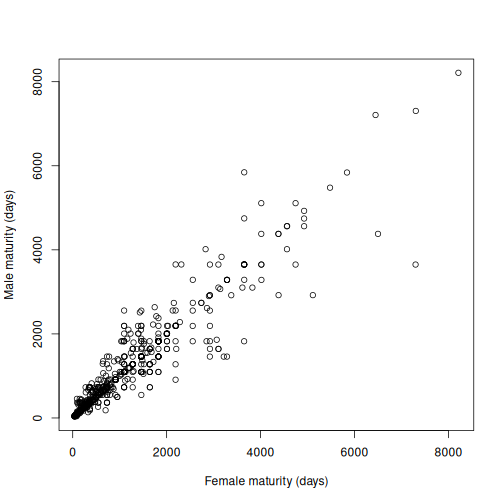

Here `xlab= "Female maturity (days)"` specifies that the label of the x axis should the text string contained in the quotes. Make sure you get the x- and y-axes labelled the right way round.

You might also see that a lot of points are bunching up near the origin of the x- and y-axes (bottom left) and that there's more variability in the top right of the graph. Sometimes a log-log plot helps the reader to see the data better. This is often the case where you have a metric such as maturation age or weight which is the result of some underlying rate such as growth. We can do a log-log plot by adding `log="xy"`as an option to plot, meaning that we want both x- and y-axes to be on the log scale.


``` r
plot(Male_maturity ~ Female_maturity, data = vertebrate_age, xlab= "Female maturity (days)", ylab = "Male maturity (days)", log = "xy")
```

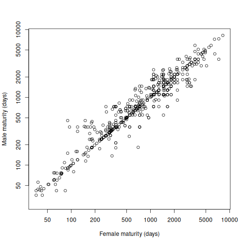

This shows quite a clear relationship. In later topics we'll show you how to quantify these relationships using correlations and linear models, but at this point we're just exploring and plotting data. Remember that if you were presenting this in a report that you would write a figure legend and place it below the figure (e.g. *Figure 1. Relationship between male and female age to maturity across vertebrate species*, or similar.)

> Try to plot litters per year (*Litters_pa*) versus female maturity.

What happens when we try to plot a variable that isn't numerical? The variable Class is an example of this, and we might be interested in seeing how age at female maturity differs between vertebrate classes. Here we can use the formula `Female_maturity ~ Class` to plot female maturity on the y-axis and Class on the x-axis.


``` r
plot(Female_maturity ~ Class, data = vertebrate_age)
```

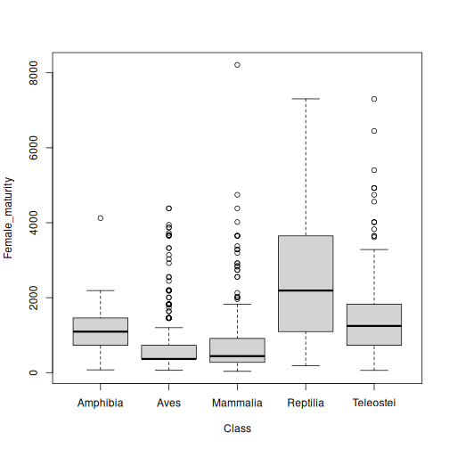

This a *boxplot* (sometimes called a box and whiskers plot). It gives the spread of values of female maturity for each of the 5 vertebrate orders. Imagine ordering all the data with each class from smallest to largest. The black horizontal line is the median, the box is the interquartile range (i.e. from the 25% to 75% quartiles), and the whiskers extend by up to 1.5x the interquartile range from the boxes, with individual points plotted that lie outside the whiskers (see [wikipedia](https://en.wikipedia.org/wiki/Box_plot) or the help page for `boxplot.stats`). Here, with one line of code, we've plotted more than a thousand data points and got a feel for the differences between vertebrate classes; reptiles, for example, might have higher age to female maturity than other vertebrate classes.

> Try changing the y-axis label.
>
> Try plotting male maturity against vertebrate class.

## ggplots

We'll now introduce you to a more powerful set of plotting functions, which are able to give a flexible set of plots to both explore and present data. These don't come bundled with the base R package but can be downloaded easily within R studio. As we covered in the introductory material in Topic 1, R has a lot of packages (collections of functions) that can be downloaded and used. To do this we need to (1) download the package we want and (2) tell R we want to use it.

To download a package, we can either navigate to *Tools \| Install packages...*, or use the function `install.packages`. We only need to do this once.

`install.packages("tidyverse")`

Every time we want to use a package, we have to tell R using the `library` function, otherwise it will return an error when it fails to find a function. (You will probably see a bunch of comments from R but unless these include the word 'fail' there's nothing to worry about.)

`library(tidyverse)`

Tidyverse is a suite of packages that are commonly used in data science that we will explore as we go through the module. In this tutorial we are going to use something called `ggplot` to create some plots.

### Scatterplots with ggplot

Let's try the male versus female maturity plot again.


``` r
# Tell R what to plot
p1 <- ggplot(data=vertebrate_age, mapping=aes(x=Female_maturity,y=Male_maturity))
```

Hopefully this line of code runs without an error. However, it won't plot anything yet. Instead you'll just see a new object, p1, appear in your environment. This first line is telling the function `ggplot` where to find the data it needs to plot with `data=vertebrate_age`. The `mapping=aes(x=Male_maturity,y=Feamle_maturity)` argument uses what's called an *aesthetic*. Essentially this tells ggplot what to put on the x- and y-axes. The result of the `ggplot` function is here assigned the object *p1*. Essentially *p1* contains the data needed to do a variety of plots. Since `ggplot` expects the first argument to `data` and the second argument to be `mapping`, the command `p1 <- ggplot(vertebrate_age, aes(x=Female_maturity,y=Male_maturity)` will also work, and you may see this simpler form later in the workshop and on-line.

To then tell R what kind of plot we want, we use the `+` symbol to add to this `ggplot` object. Having created object *p1*, now try


``` r
# Tell R how to plot it
p1 + geom_point()
```


You now have something very similar to the graph you had before. Adding the `geom_point` function creates a scatter plot. (Don't worry about the warnings, these are just R telling you that it's ignored a bunch of missing values). Specifying `geom_point()` without any arguments just means that `geom_point` inherits all the data that we set up with `ggplot` and plots with its defaults.

We can quickly add or modify other elements of this plot. Previously we had (1) changed the x- and y-axes labels, and (2) plotted on a log-log scale. To change the labels we use `xlab` and `ylab` again by adding these elements using `+`


``` r
p1 + geom_point() +
  xlab("Female maturity (days)") + ylab("Male maturity (days)")
```

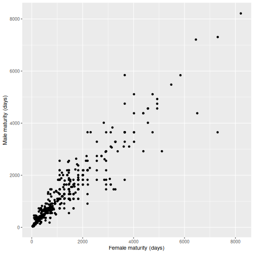

(We can split the code across lines so long as the `+` appears at the end of the line. This is a good illustration of why you really want to create code in a .R file so you're not having to retype everything on the console.)

To tell R to plot axes on a log scale, we can use `scale_x_log10` and `scale_y_log10`


``` r
p1 + geom_point() +
  xlab("Female maturity (days)") + ylab("Male maturity (days)") +
  scale_x_log10() + scale_y_log10()
```

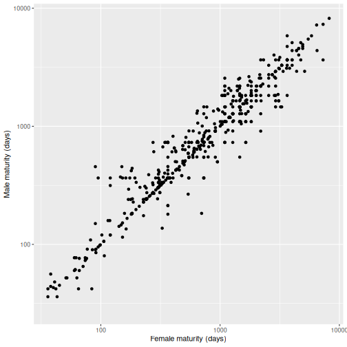

Here, we've taken a basic plot and added or changed successive elements to it. This is how one might generate a publication-ready plot, by changing it until we're happy with it. Unlike a point-and-click interface we can easily run the code again, including on a different set of data.

We can also change the visual feel of a plot using a *theme*. You might prefer one theme for a talk presentation and another for submitting a manuscript to a journal. To see this try


``` r
p1 + geom_point() +
  xlab("Female maturity (days)") + ylab("Male maturity (days)") +
  scale_x_log10() + scale_y_log10() +
  theme_bw()
```


> Instead of `theme_bw()`, try `theme_dark()` or `theme_classic()`.
>
> Instead of `theme_bw()`, try `theme_bw(base_size=16)`.
>
> What changes? Look at the help page for `theme_bw` to see what you can change.

To plot a different pair of variables you just need to change what you're asking ggplot to plot, eg. change

`p1 <- ggplot(data=vertebrate_age, aes(x=Female_maturity,y=Male_maturity))`

to

`p2 <- ggplot(data=vertebrate_age, aes(x=Female_maturity,y=Litters_pa))`

This will let you plot litters per year against female maturity. Then you just add the same elements you've just used to the object p2 to create a consistent look to all your plots in a report or paper. (But don't forget to change the y-axis label since we're plotting something new on the y-axis.) You also don't have to call your ggplot objects, *p1*, *p2*, *etc*; you can call them anything you like.


``` r
p2 <- ggplot(data=vertebrate_age, aes(x=Female_maturity,y=Litters_pa))
p2 + geom_point() +
  xlab("Female maturity (days)") + ylab("Litters per year") +
  scale_x_log10() + scale_y_log10() +
  theme_bw()
```

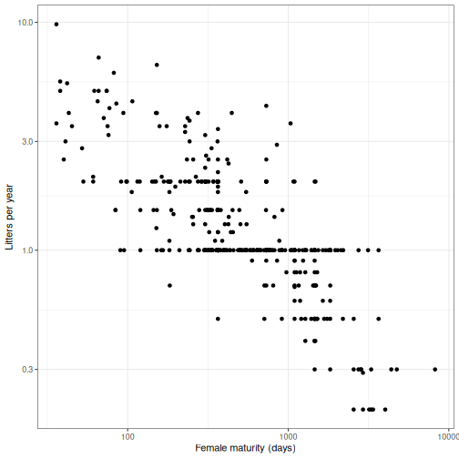

### Boxplots with ggplot

There are lots of different types of plots we use `ggplot` for. Let's go back to the boxplot we did before of female maturation versus vertebrate class. This is quite simple in `ggplot`. First set up `ggplot` with the data we want to plot (female maturity versus vertebrate class).


``` r
p3 <- ggplot(data=vertebrate_age,aes(x=Class, y=Female_maturity))
```

Then say what kind of plot we want


``` r
p3 + geom_boxplot()
```

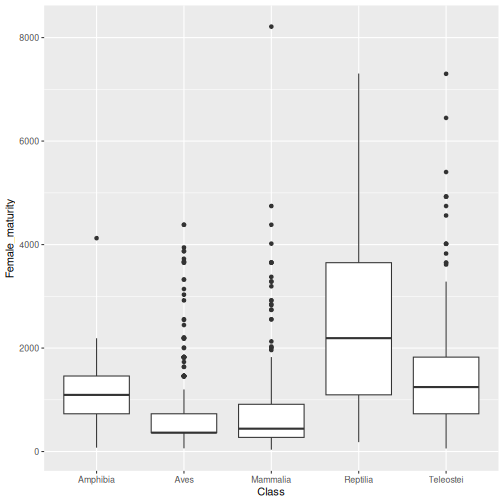

That's it, although we can easily change axes labels, theme, etc as we did before.

### Groups with ggplot

This is a little more advanced, so don't worry if you don't get it straight away. So far we've plotted 2 continuous variables against each other (a scatter plot) and a continuous variable against a categorical variable (i.e. a factor). Suppose we were interested in showing the relationship between male and female maturation in each of the 5 vertebrate classes. We could create 5 sets of data and plot each separately, but this would be laborious and prone to error. Instead we can let R do the work.

To deal with groups we can either colour the data-points by group, or plot in separate panels. In both cases we need to first tell ggplot what groups we're interested in using `aes`.

Let's start with colours. Instead of `aes(x=Female_maturity,y=Male_maturity)`, we'll add `color` to `aes` simply as `color=Class`


``` r
p4 <- ggplot(data=vertebrate_age, aes(x=Female_maturity, y=Male_maturity, color=Class))
```

Then we just use the same code that we used before, and `ggplot` will automatically colour by group


``` r
p4 + geom_point() +
  xlab("Female maturity (days)") + ylab("Male maturity (days)") +
  scale_x_log10() + scale_y_log10() +
  theme_bw()
```

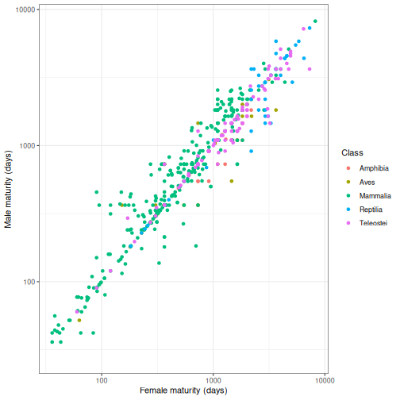

The second way is to produce separate plots in a panel. This can be useful if lots of points are plotted over each other, which can make it hard to see the different colours. To do this we can add `facet_wrap(~ Class)`, where `facet_wrap` tells `ggplot` to split the plot into different panes (or 'facets') and the `~ Class` bit says what variables we want to split the plot with, in this case vertebrate Class.


``` r
p4 + geom_point() +
  xlab("Female maturity (days)") + ylab("Male maturity (days)") +
  scale_x_log10() + scale_y_log10() +
  theme_bw() + facet_wrap(~ Class)
```


(For a report or paper, you probably wouldn't want to plot a different colour in each panel – black points would give the same information. But it might look quite snazzy in a talk presentation. If you wanted to remove the colour, you'd just remove `color=Class` from `aes` on the first line.)

As you go through this module, RStudio help menu (on the top bar) has a series of cheat sheets, including one on [data visualisation with `ggplot`](https://raw.githubusercontent.com/rstudio/cheatsheets/main/data-visualization.pdf). This is a useful resource to refer to.

> Adapt the code you've just used to show the relationship between maximum longevity (in years) and female maturity (in days). Label the axes appropriately.
>
> What does `geom_smooth` do? How would you add this to your plot?

## Distributions

In exploring data, its often useful to understand how a variable is distributed, since this will tell you features of the data and the best way to analyse it. We might be interested in the mean value of a set of data, and whether values are grouped closely around it or whether the data points are spread evenly around the mean. We'll cover this more in the next topics on statistical analysis.

Let's look at a human data set on diabetes and obesity in a population of Pima Native Americans. As before, download it from Canvas into your directory and read it in. Note that it's a text file with values separated by spaces not commas, so we use `read.table`.


``` r
pima <- read.table("pima.txt",header=TRUE)
```


Then you can use `View(pima)`, `summary(pima)`, etc to see what it looks like.

Hopefully you can see that many of the variables, such as bmi, glucose and diastolic, are continuous variables, but are these distributed in a symetrical, bell-shaped (normal) distribution, or are they slumped to one side? To look at these we can use histograms. These essentially split the data into a number of equally-sized bin and count the number of values that fall into each bin. For example, if you were interested in height, you could count how many people in your dataset were between 130cm and 140cm, then count the number of people between 140cm and 150cm, and so on, and then plot these out.

Let's show this with the variable 'diastolic' (a measure of blood pressure). You can do this in base R with the function `hist`, but to get you more used to `ggplot`, let's do it in `ggplot` with the function `geom_histogram`. As before, we first tell `ggplot` what we want to plot and then how we want to plot it.


``` r
# what we want to plot
h1 <- ggplot(data=pima, aes(x=diastolic))

# how we want to plot it
h1 + geom_histogram()
```

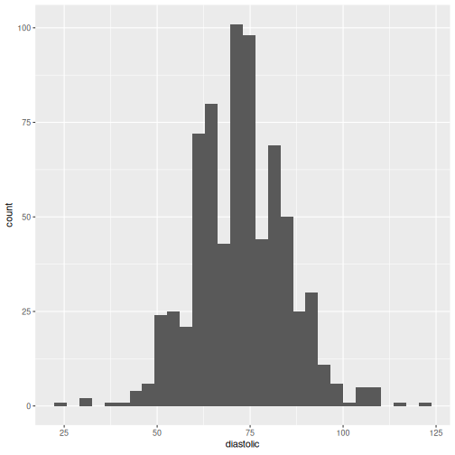

This looks a fairly symmetrical distribution and roughly bell-curve shaped. Because there are quite a lot of bins (30 in this case; the vertical black bars) the data looks a bit lumpy. This would probably even out if we had a few hundred more rows of data. Since we don't, we can try to smooth this out a bit by using fewer bins.

> Swap `geom_histogram()` for `geom_histogram(bins=12)` in the code above. Does it change the data or does it change how the data are presented?

An alternative way to investigate distributions is to ask `ggplot` to plot what is essentially a smoothed version of a histogram using `geom_density`. To do this we just swap `geom_density` for `geom_histogram`:


``` r
h1 + geom_density()
```

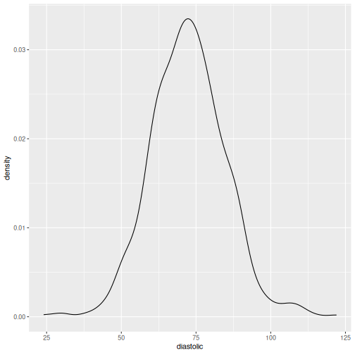

(You might have noticed that the graph that results from `geom_density` has a y-axis labelled 'density' rather than 'count', since rather than count the number of individuals in a particular bin, it estimates the probability of an individual having a particular x value – known as a *probability density function*. You don't need to worry about the details here.)

It's also possible to get a feel for a distribution by using `summary`


``` r
summary(pima$diastolic)
```

:::{dropdown} Show expected output
```text
##    Min. 1st Qu.  Median    Mean 3rd Qu.    Max.    NA's
##   24.00   64.00   72.00   72.43   80.00  122.00      35
```
:::

Here we see that diastolic is symmetrically distributed because the mean and the median are very similar and the median lies midway between the 1st and 3rd quartiles.

Let's try another variable in the Pima dataset, insulin.


``` r
# we just change what we want to plot here
h2 <- ggplot(data=pima, aes(x=insulin))

# we plot in the same way as before
h2 + geom_histogram()
```

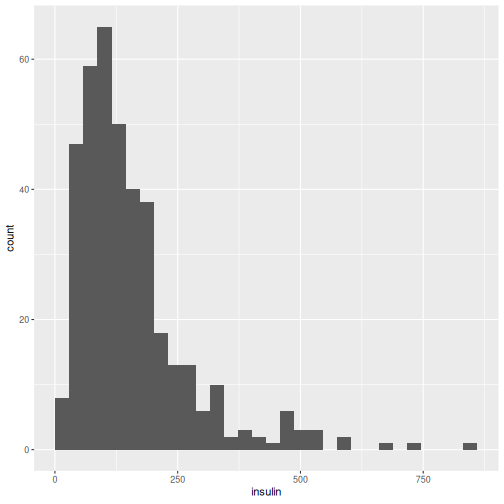

``` r
h2 + geom_density()
```

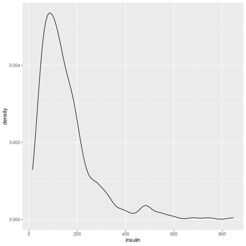

Here we see that the distribution has a long tail to the right. There are a significant proportion of individuals with high insulin levels. The data set was originally collected to investigate high levels of diabetes in this community.

> Do this a couple more times yourself to get the hang of it.
>
> From the Pima dataset, plot the distribution of bmi and glucose.
>
> From the vertebrate age data set, plot the distribution of female maturity.

## Knowledge Check

Use the [LIFE707 BioBoost Knowledge Checks](https://canvas.liverpool.ac.uk/courses/93992/assignments/357982)
after working through this chapter. They help you retrieve and apply the key
ideas, including choosing an appropriate plot, interpreting a distribution,
and understanding how `ggplot2` builds figures.

Attempt the questions before looking back at the chapter. Any gaps you find
will help you focus your questions during a workshop or drop-in session.

## Exercises

Create a new R script called `exercises.R` in your `LIFE707/Topic_2` folder.
Use this file to keep your exercise solutions separate from the code you have
been working on during the workshop.

The following provide additional practice. Try to give them a good go yourself,
using the help pages and Google if needed, before looking at the answers.

### Exercise 1

The file <a href="/data/topic-2-data-visualisation/caffeine.txt?download=1">caffeine.txt</a> contains the values of the urinary metabolic ratio of 5–acetylamino–6–formylamino–3–methyluracil to 1–methylxanthine (AFMU/1X) after oral administration of caffeine.

1. Plot a histogram of the data and comment on its distribution.

### Exercise 2

The file <a href="/data/topic-2-data-visualisation/pancreatic.csv?download=1">pancreatic.csv</a> contains the concentrations of 2 biomarkers, CA19-9 and CA125 (in U/ml), in control (healthy) and diseased (diagnosed with pancreatic cancer) individuals.

1. Plot these data to investigate the relationship of each biomarker to disease state.

### Exercise 3

The file <a href="/data/topic-2-data-visualisation/plant_height.csv?download=1">plant_height.csv</a> contains data on the heights of different plants, plus various ecological factors from where they grow.

1. Produce a plot to compare the height (in metres) of different growth forms (herb, shrub or tree).
2. Produce a plot of how the height of these different growth forms vary with rain (the column 'rain', in mm/yr). Label the axes appropriately. What does `geom_smooth()` do? Try adding it to your plot.

(video-walkthroughs-topic-2)=
## Video Walkthroughs

This captioned walkthrough demonstrates the Topic 2 code and how to create
the plots in RStudio.

<div style="position: relative; width: 100%; aspect-ratio: 16 / 9; margin-bottom: 2rem;">
  <iframe src="https://liverpool.cloud.panopto.eu/Panopto/Pages/Embed.aspx?id=6be71cd5-d954-426b-85cf-b1ab00d772a9&amp;autoplay=false&amp;offerviewer=true&amp;showtitle=true&amp;showbrand=true&amp;captions=true&amp;interactivity=all" style="border: 1px solid #464646; position: absolute; top: 0; left: 0; width: 100%; height: 100%; box-sizing: border-box;" allowfullscreen allow="autoplay" aria-label="Panopto Embedded Video Player" aria-description="Topic 2 code run through"></iframe>
</div>

## Exercise solutions

These solutions assume that you have already run `library(tidyverse)` in your
R session. Run the code yourself, compare it with your own work, and make sure
that you understand every line before relying on it.

### Exercise 1

```r
# Read the caffeine-metabolism data.
caffeine <- read.table("caffeine.txt", header = TRUE)

# Plot the distribution of the enzyme ratio.
ggplot(caffeine, aes(x = enzyme.ratio)) +
  geom_histogram(bins = 25) +
  labs(x = "AFMU/1X enzyme ratio", y = "Count") +
  theme_bw()
```

### Exercise 2

```r
# Read the biomarker data and store disease status as a factor.
pancreatic <- read.csv("pancreatic.csv")
pancreatic$status <- factor(pancreatic$status)

# Put the two biomarker columns into one column so that they can be plotted
# using the same ggplot code.
pancreatic_long <- pivot_longer(
  pancreatic,
  cols = c(CA19.9, CA125),
  names_to = "biomarker",
  values_to = "concentration"
)

# Compare the concentration of each biomarker between disease-status groups.
# Log scaling makes the large range of concentrations easier to see.
ggplot(pancreatic_long, aes(x = status, y = concentration)) +
  geom_boxplot() +
  scale_y_log10() +
  facet_wrap(~ biomarker, scales = "free_y") +
  labs(x = "Disease status", y = "Biomarker concentration (U/ml)") +
  theme_bw()
```

### Exercise 3

```r
# Read the plant data and store growth form as a factor.
plants <- read.csv("plant_height.csv")
plants$growthform <- factor(plants$growthform)

# Compare plant height between herbs, shrubs, and trees.
ggplot(plants, aes(x = growthform, y = height)) +
  geom_boxplot() +
  labs(x = "Growth form", y = "Height (m)") +
  theme_bw()

# Plot height against rainfall. Colour creates a separate set of points and a
# separate fitted line for each growth form. geom_smooth(method = "lm") adds
# the fitted linear-model trend for each group.
ggplot(plants, aes(x = rain, y = height, colour = growthform)) +
  geom_point() +
  geom_smooth(method = "lm", se = FALSE) +
  scale_y_log10() +
  labs(x = "Rainfall (mm/year)", y = "Height (m)", colour = "Growth form") +
  theme_bw()
```

## Getting help

Bring the exact error message, your R script, and the relevant data file to a
workshop or a drop-in session. A screenshot is useful too. Keeping each topic's
files together lets us help you find and fix problems quickly.
