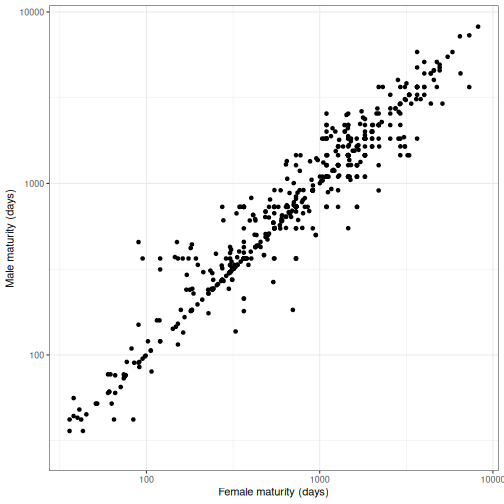
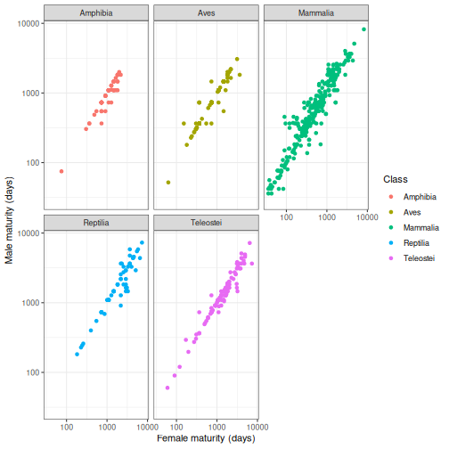

*Updated by Dr. Robert Treharne on 24 September 2026.*

In this topic you will learn to explore and communicate biological data using
plots in R. You will use both the plotting tools included with R and
`ggplot2`, which provides a flexible way to build clear figures.

:::{important}
Complete the [Topic 1](topic-1.md) chapter before starting this topic. You
will need to be able to create a folder, save an R script, set a working
directory, and read data into R.
:::

:::{tip} Video walkthroughs
If you get stuck or are not sure about the written material, the captioned
video walkthroughs at the end of this chapter are a useful way to improve your
understanding. You may wish to bring wired headphones to future workshops if
you would like to listen to the audio.
:::

## Files for this week

Create a `LIFE707/Topic_2` folder and download these files into it before the
workshop. They are included with this book, so you do not need to return to
Canvas.

- <a href="/data/topic-2-data-visualisation/vertebrate_age.csv?download=1">vertebrate_age.csv</a>: longevity and life-history data for vertebrate species.
- <a href="/data/topic-2-data-visualisation/pima.txt?download=1">pima.txt</a>: diabetes and obesity measurements from a Pima population.
- <a href="/data/topic-2-data-visualisation/caffeine.txt?download=1">caffeine.txt</a>: caffeine-metabolism data for an additional exercise.
- <a href="/data/topic-2-data-visualisation/plant_height.csv?download=1">plant_height.csv</a>: plant heights, growth forms, and environmental data.
- <a href="/data/topic-2-data-visualisation/pancreatic.csv?download=1">pancreatic.csv</a>: two biomarkers measured in healthy and diseased individuals.

## Getting started

Open RStudio and create a new R script called `Topic_2_notes.R` in your
`LIFE707/Topic_2` folder. Set this folder as your working directory, then read
the vertebrate data into R.

```r
vertebrate_age <- read.csv("vertebrate_age.csv")
head(vertebrate_age)
summary(vertebrate_age)
View(vertebrate_age)
```

If R cannot find the file, check both the working directory with `getwd()` and
the list of files with `dir()`. Revisit the reading-data material in Topic 1
if needed.

The dataset contains many variables. We will focus on a few, including
vertebrate `Class`, female and male maturity, litter frequency, and maximum
longevity. To see the names of all columns, use:

```r
names(vertebrate_age)
```

### Factors

`Class` records a category, rather than a measurement. Its values include
Amphibia, Aves, Mammalia, Reptilia, and Teleostei. Categorical variables are
often stored as *factors* in R. Convert this column and inspect the result:

```r
vertebrate_age$Class <- factor(vertebrate_age$Class)
summary(vertebrate_age$Class)
```

Try converting `Phylum` and `Order` to factors too. Factors will be important
throughout the module whenever you compare groups such as treatments, sexes,
or species.

## Simple plots in R

The base-R `plot()` function is a quick way to explore a relationship. Plot
male maturity against female maturity across vertebrate species:

```r
plot(Male_maturity ~ Female_maturity, data = vertebrate_age)
```

Because both variables are numeric, R produces a scatterplot. Add descriptive
axis labels whenever you make a plot for someone else to read:

```r
plot(Male_maturity ~ Female_maturity,
     data = vertebrate_age,
     xlab = "Female maturity (days)",
     ylab = "Male maturity (days)")
```

Many biological measurements are concentrated near zero with a few very large
values. A log scale can make this pattern easier to see. The following changes
both axes to a logarithmic scale:

```r
plot(Male_maturity ~ Female_maturity,
     data = vertebrate_age,
     xlab = "Female maturity (days)",
     ylab = "Male maturity (days)",
     log = "xy")
```


At this stage, use plots to explore patterns. Later topics will introduce ways
to quantify relationships using correlations and models.

When one variable is categorical and the other is numeric, `plot()` produces a
boxplot. This shows the distribution of female maturity in each vertebrate
class:

```r
plot(Female_maturity ~ Class, data = vertebrate_age,
     xlab = "Vertebrate class", ylab = "Female maturity (days)")
```

The horizontal line in each box is the median. The box covers the middle half
of the data, the interquartile range. The whiskers extend beyond the box and
points outside them are plotted individually.

## Plotting with ggplot2

`ggplot2` is a package for creating flexible, publication-quality plots. If it
is not already installed on the computer you are using, install it once:

```r
install.packages("ggplot2")
```

Then load it at the start of each new R session:

```r
library(ggplot2)
```

The first line below creates a plotting object. It specifies the dataset and
which variables appear on the x- and y-axes. The second line adds points.

```r
p1 <- ggplot(vertebrate_age,
             aes(x = Female_maturity, y = Male_maturity))

p1 + geom_point()
```

Build a clearer version by adding labels, log scales, and a theme. The `+` at
the end of a line tells R that the command continues on the next line.

```r
p1 +
  geom_point() +
  xlab("Female maturity (days)") +
  ylab("Male maturity (days)") +
  scale_x_log10() +
  scale_y_log10() +
  theme_bw()
```



Try `theme_classic()` or `theme_dark()` in place of `theme_bw()`. You can also
use `theme_bw(base_size = 16)` to make text larger.

### Boxplots, groups, and facets

Create a boxplot of female maturity across vertebrate classes:

```r
p2 <- ggplot(vertebrate_age, aes(x = Class, y = Female_maturity))
p2 + geom_boxplot() +
  xlab("Vertebrate class") +
  ylab("Female maturity (days)") +
  theme_bw()
```

You can show groups in a scatterplot by mapping `Class` to colour:

```r
p3 <- ggplot(vertebrate_age,
             aes(x = Female_maturity, y = Male_maturity, colour = Class))

p3 +
  geom_point() +
  scale_x_log10() +
  scale_y_log10() +
  xlab("Female maturity (days)") +
  ylab("Male maturity (days)") +
  theme_bw()
```

Alternatively, use facets to show each class in a separate panel. This is
particularly useful when points overlap.

```r
p3 +
  geom_point() +
  scale_x_log10() +
  scale_y_log10() +
  xlab("Female maturity (days)") +
  ylab("Male maturity (days)") +
  theme_bw() +
  facet_wrap(~ Class)
```



For further reference, RStudio provides a useful
[ggplot2 data-visualisation cheat sheet](https://raw.githubusercontent.com/rstudio/cheatsheets/main/data-visualization.pdf).

## Distributions

Plots of a distribution help you understand how values are spread. Read the
Pima data, which are whitespace-separated rather than comma-separated:

```r
pima <- read.table("pima.txt", header = TRUE)
head(pima)
summary(pima)
```

A histogram divides a variable into intervals, called bins, and counts the
observations in each interval. Plot diastolic blood pressure with:

```r
h1 <- ggplot(pima, aes(x = diastolic))
h1 + geom_histogram()
```

Try a smaller number of bins. This changes the appearance of the plot, not the
underlying data.

```r
h1 + geom_histogram(bins = 12)
```

A density plot is a smoothed representation of a distribution:

```r
h1 + geom_density()
```


Compare the mean and median in `summary(pima$diastolic)`. A similar mean and
median can suggest a roughly symmetrical distribution. Now explore insulin,
which has a longer right-hand tail:

```r
h2 <- ggplot(pima, aes(x = insulin))
h2 + geom_histogram()
h2 + geom_density()
```

## Knowledge Check

Use the [LIFE707 BioBoost Knowledge Checks](https://canvas.liverpool.ac.uk/courses/93992/assignments/357982)
after working through this chapter. They help you retrieve and apply the key
ideas, including choosing an appropriate plot, interpreting a distribution,
and understanding how `ggplot2` builds figures.

Attempt the questions before looking back at the chapter. Any gaps you find
will help you focus your questions during a workshop or drop-in session.

## Exercises

Work through these exercises in your `Topic_2_notes.R` script. Save each plot
and annotate your code so that you can understand it later.

### Vertebrate-age data

1. Use `ggplot2` to plot litter frequency (`Litters_pa`) against female
   maturity. Label both axes appropriately. Would log scales help?
2. Plot maximum longevity (`Maximum_longevity`) against female maturity. Add
   `geom_smooth()` and use the help page to find out what it adds to the plot.
3. Make a boxplot of male maturity for each vertebrate class. Make sure the
   axis labels explain the data and units.

### Exploring distributions

1. From `pima.txt`, plot histograms and density plots for `bmi` and `glucose`.
   Describe the distribution of each variable.
2. Make a histogram of female maturity in the vertebrate-age data. Experiment
   with the number of bins and describe what changes.
3. Read `caffeine.txt` into R and plot a histogram of `enzyme.ratio`. Comment
   on its distribution.

### Additional plotting practice

1. Read `pancreatic.csv`. Use plots to investigate the relationship of each
   biomarker, `CA19.9` and `CA125`, to disease status. Choose plot types that
   make the group comparison clear.
2. Read `plant_height.csv`. Compare height in metres among the growth forms,
   herb, shrub, and tree.
3. Plot plant height against rainfall (`rain`) and distinguish growth forms in
   the plot. Label the axes with units. Add `geom_smooth()` and decide whether
   it helps communicate the pattern.

(video-walkthroughs-topic-2)=
## Video Walkthroughs

Captioned Topic 2 walkthroughs will be added here. Use them alongside the
written material if you need to see the code and plots being developed in
RStudio.

## Getting help

Bring the exact error message, your R script, and the relevant data file to a
workshop or a drop-in session. A screenshot is useful too. Keeping each topic's
files together lets us help you find and fix problems quickly.
