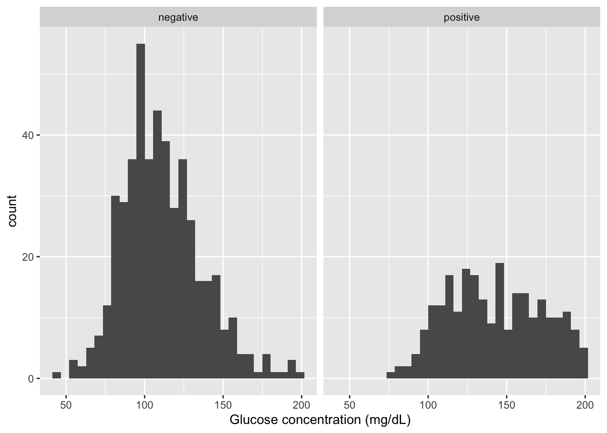
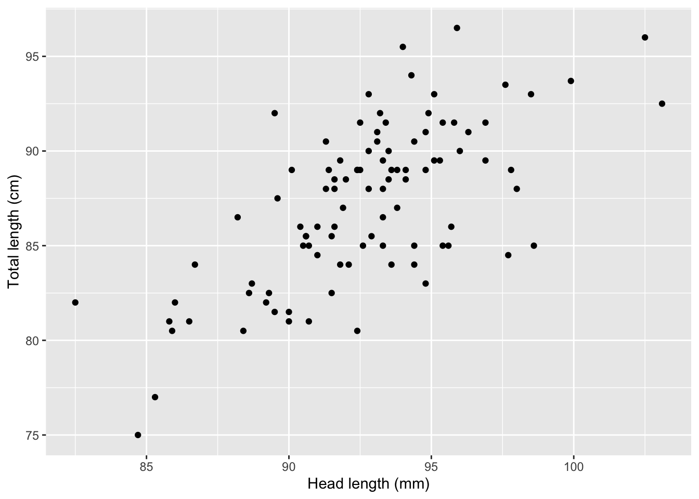
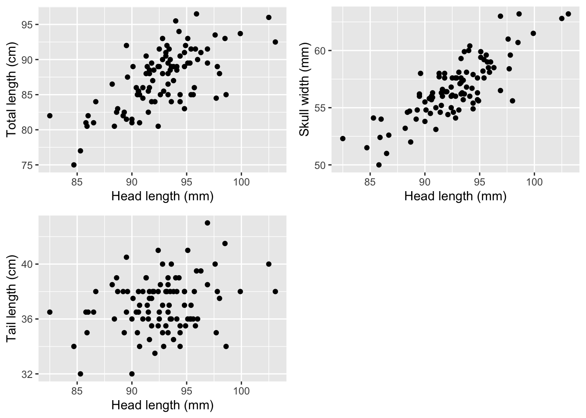
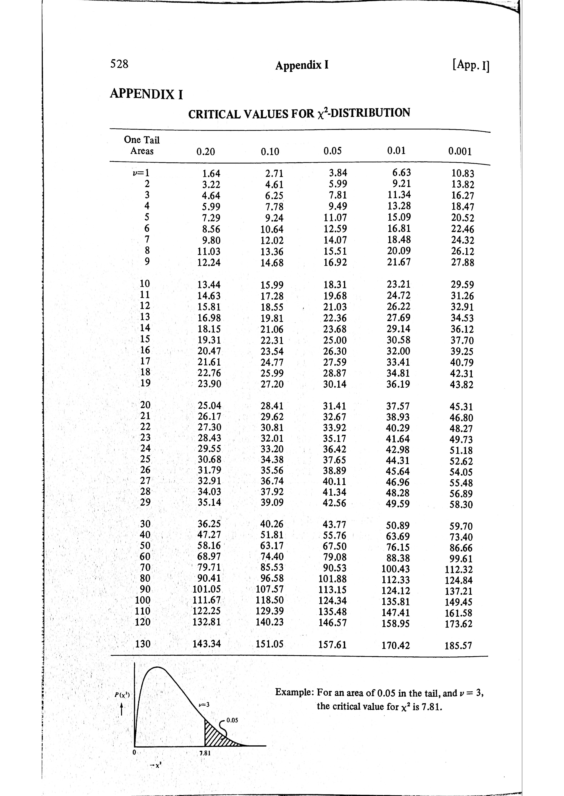

*Updated by Dr. Robert Treharne on 25 September 2026.*

In this topic you will use three common statistical tests to answer biological
questions: a t-test to compare two groups, a correlation test to assess the
relationship between two continuous variables, and a chi-square test to assess
an association between categorical variables.

:::{important}
Complete [Topic 2](topic-2.md) before starting this chapter. You will need to
be able to read data into R, inspect a data frame, and make basic plots with
`ggplot2`.
:::

:::{tip} Video walkthroughs
If you get stuck or are not sure about the written material, the video
walkthrough placeholders at the end of this chapter will be replaced with
captioned videos. They are designed to support the t-test, correlation,
chi-square, and exercise material.
:::

:::{important} Watch before the workshop
This video introduces the core ideas behind the statistical tests in this
topic. Please watch it before starting the workshop material. It is important
preparation for choosing, running, and interpreting the tests that follow.
:::

<div style="position: relative; width: 100%; aspect-ratio: 16 / 9; margin-bottom: 2rem;">
  <iframe src="https://liverpool.cloud.panopto.eu/Panopto/Pages/Embed.aspx?id=759c31d9-7dfa-45a4-b541-b1d300a24c95&amp;autoplay=false&amp;offerviewer=true&amp;showtitle=true&amp;showbrand=true&amp;captions=true&amp;interactivity=all" style="border: 1px solid #464646; position: absolute; top: 0; left: 0; width: 100%; height: 100%; box-sizing: border-box;" allowfullscreen allow="autoplay" aria-label="Panopto Embedded Video Player" aria-description="Basic statistical tests"></iframe>
</div>

## Files for this week

Create a `LIFE707/Topic_3` folder and download the files you need into it.
They are included with this book, so you do not need to return to Canvas.

- <a href="/data/topic-3-basic-statistical-tests/pima_cleaned.txt?download=1">pima_cleaned.txt</a>: cleaned diabetes and health measurements.
- <a href="/data/topic-3-basic-statistical-tests/pima.20.txt?download=1">pima.20.txt</a>: a smaller Pima-data sample for the t-test exercise.
- <a href="/data/topic-3-basic-statistical-tests/chickwts_edited.csv?download=1">chickwts_edited.csv</a>: chicken weights from two feed groups.
- <a href="/data/topic-3-basic-statistical-tests/possum.csv?download=1">possum.csv</a>: morphological measurements from short-eared possums.
- <a href="/data/topic-3-basic-statistical-tests/barley.csv?download=1">barley.csv</a>: barley genotype and virus-infection status.
- <a href="/data/topic-3-basic-statistical-tests/pcrscreen.csv?download=1">pcrscreen.csv</a>: fruit-fly PCR screening data.
- <a href="/data/topic-3-basic-statistical-tests/gamma_data.txt?download=1">gamma_data.txt</a>: skewed data for the optional rank-test material.
- <a href="/data/topic-3-basic-statistical-tests/mycosize.csv?download=1">mycosize.csv</a>: an additional dataset for independent practice.

## Hypothesis testing

In the last topic we described data graphically. Plotting data is good at suggesting patterns in the data. Statistical testing then formalises questions we might ask, is there a difference between two groups? If individuals are bigger for one variable do they also tend to be bigger for another variable? If we see a lot of one thing happening do we also see a lot of another thing happening?

Statistical tests are usually framed by testing a null hypothesis, where the null hypothesis is that the pattern we're interested in could have occurred by random chance. A statistical test assigns a probability to this - a p-value. A low p-value indicates that there is very little chance that the observed data could have arisen without there being a difference in the mean between two groups A and B, that is is unlikely there is no correlation between variables x and y, or that smoking does not cause lung cancer, etc. In biology, we typically take a p-value of less than 5% (p \< 0.05) as 'significant', i.e. we reject the null hypothesis and

What follows is a practical guide to how to apply three simple and commonly used statistical tests in R. For further theoretical background, please refer to the video at the start of the topic or any standard statistical textbook. In later topics, we'll introduce further statistical tests that build on these. Throughout the module, we won't delve deeply into the maths underpinning these or other statistical tests, confining ourselves mostly to when and how to use them rather than how they work.

## Comparing between 2 groups: t-test

We'll be doing some plots in `ggplot` so we need to load the tidyverse package.

```r
library(tidyverse)
```

The tidyverse is a collection of R packages for working with data. It includes `ggplot2`, which we use for the plots in this chapter. Loading `tidyverse` makes `ggplot2` available, alongside packages that we will use for data wrangling in later topics.

If R returns `Error in library(tidyverse) : there is no package called
‘tidyverse’`, install the package by running the following command once in the
Console:

```r
install.packages("tidyverse")
```

After installation has finished, run `library(tidyverse)` again. You need to
install a package only once on a computer, but you need to load it again each
time you start a new R session.

We'll return to the dataset of Pima Native Americans and diabetes. I've created a version of this called pima_cleaned.txt which has missing values removed and is easier to work with for the exercises here (cleaning data is covered in the next topic). Download this and read it in.

```r
pima <- read.table("pima_cleaned.txt",header=TRUE) #we'll just call the dataframe pima
pima$test<- factor(pima$test) # test is either positive or negative for diabetes and we tell R it's a factor

#What does it look like, can also use View(pima)
summary(pima)
```

:::{dropdown} Show expected output
```text
       test          age           glucose        diastolic
 negative:475   Min.   :21.00   Min.   : 44.0   Min.   : 24.00
 positive:248   1st Qu.:24.00   1st Qu.: 99.5   1st Qu.: 64.00
                Median :29.00   Median :117.0   Median : 72.00
                Mean   :33.36   Mean   :121.8   Mean   : 72.39
                3rd Qu.:41.00   3rd Qu.:141.5   3rd Qu.: 80.00
                Max.   :81.00   Max.   :199.0   Max.   :122.00
      bmi
 Min.   :18.20
 1st Qu.:27.50
 Median :32.40
 Mean   :32.43
 3rd Qu.:36.60
 Max.   :67.10
```
:::

-   *Test*. Diabetes test result (positive/negative)

-   *Age* in years

-   *Glucose*. Glucose tolerance test (mg glucose/dL plasma)

-   *Diastolic* blood pressure (mm Hg)

-   *BMI*. Body mass index (kg/(height in m)^2^)

In the last topic we used the pima dataset to plot distributions. Let's use what you learnt there to explore the distribution of glucose.

```r
#what to plot, we're interested in glucose distribution
pima.hist <- ggplot(data=pima, mapping = aes(x=glucose))

#how to plot it, histograms for negative and positive individuals
pima.hist + geom_histogram() + facet_wrap(~test) +
  xlab("Glucose concentration (mg/dL")


#you could also try
#pima.hist + geom_density() + facet_wrap(~test)

```



Before we get any further with running a test or further coding let's pause and see what patterns are in the data. We've plotted histograms to give the distribution of glucose concentrations found in individuals testing positive or negative for diabetes. These distributions are fairly symmetrical. The distribution for negative individuals is taller than that for positive individuals. This just means there are more negative than positive individuals in the dataset. The distribution for positive individuals is centered further along the x-axis, indicating it has a higher mean value than negative individuals. So plotting the data therefore gives rise to the hypothesis that diabetic positive individuals have higher glucose concentration than negative individuals.

What we want to do is to test; are the means between the two groups significantly different from each other? (Or, can we reject the null hypothesis that these two distributions could have arisen by chance with no difference between groups?). At the end of this section, we'll run a single line of R code that will tell us this using a t-test. But, to understand what's going on, let's first calculate the mean, standard deviation and standard error for each group.

Some definitions, which many of you will be familiar with.

-   [Mean](https://en.wikipedia.org/wiki/Mean). Often called the average, this adds up all the values in a group and divides by the number of datapoints in the group. The mean $\bar{x}$ for a set of data ${x_{1}, x_{2}, ...,x_{i}, ... x_{n}}$ is $\bar{x} = \frac{\sum(x)}{n}$. To calculate the mean of a set of data in R we'd use `mean(x)`.

-   [Standard deviation](https://en.wikipedia.org/wiki/Standard_deviation). This is a measure of the spread of data around the mean. Each datapoint will be either larger or smaller than the mean, and a higher standard deviation means that datapoints will tend, on average, to be further away from the mean. The standard deviation, sd, is $sd=\sqrt{\frac{\sum(x_{i}-\bar{x})^{2}}{n}}$. To calculate the standard deviation of a set of data in R we'd use `sd(x)`.

-   [Standard error](https://en.wikipedia.org/wiki/Standard_error). This is a measure of how confident we are that the mean we calculate from the sample of data we've collected really reflects the mean from the population we've taken those samples from. Because individuals vary, if we only measure one or two individuals we will have less confidence that the sample we've taken gives us a good estimate of the 'true' population mean than we would if we took a sample of hundreds of individuals. (This is why polling companies survey hundreds of people rather than ask a couple of random people on the street.) The standard error, se, is $se = \frac{sd}{\sqrt{n}}$. To calculate the standard error of a set of data in R we'd use `sd(x)/sqrt(n)`.

We need to separate the two groups of negative and positive individuals. In the next topic you'll learn some powerful ways to subset and analyse dataframes, but let's do something simple here. In Topic 1 we touched on how to subset a dataframe using square brackets. For example, we took a dataframe called disox and the code `disox[1:4,]` returned the first 4 rows of the dataframe, where `1:4` is notation for the sequence {1, 2, 3, 4}. Instead of `1:4`, we can give a condition and return all rows where that condition is true. Thus, to create subsets of the pima data corresponding to individuals where the test is positive, we can write:

```r
pima.positive <- pima[pima$test=="positive",]
```

similarly:

```r
pima.negative <- pima[pima$test=="negative",]
```

We now have two dataframes, pima.negative and pima.positive split by negative vs positive individuals. Try `summary` on each dataframe.

Let's get the mean glucose level for negative individuals and for positive individuals.

```r
mean(pima.negative$glucose)
mean(pima.positive$glucose)
```

:::{dropdown} Show expected output
```text
[1] 111.0168
[1] 142.4597
```
:::

So that's a difference of around 30 mg/dL between the 'average' negative and the 'average' positive individual. But individuals in a group don't all have exactly the same value; there will be variation among individuals. We quantify this variation using the standard deviation.

```r
sd(pima.negative$glucose)
sd(pima.positive$glucose)
```

:::{dropdown} Show expected output
```text
[1] 25.01071
[1] 30.0252
```
:::

So even within a group, it's not unusual for an individual to be 25 or 29 mg/dL higher or lower than the mean for that group. Look back at the histograms we plotted for positive and negative individuals and this ties in with that.

Nevertheless, on those histograms, there's a lot of data within each group and, despite overlap between the two groups, our intuition would probably tell us that there are typically higher glucose levels in the positive group. Calculating the standard error formalises this intuition and provides a relationship between the amount of data we have and our confidence in saying where the mean is. Because the standard error is the standard deviation divided by the square root of the sample size, the bigger the sample size the smaller the standard error.

First we need to count how many individuals are positive and how many are negative. We saw this at the start when we read in the data using `summary(pima)`. (You could also try `table(pima$test)` or `nrow(pima.positive)` if you like.) There are 475 negative and 248 positive individuals.

To get the standard errors

```r
#negative
sd(pima.negative$glucose)/sqrt(475)

#positive
sd(pima.positive$glucose)/sqrt(248)
```

:::{dropdown} Show expected output
```text
[1] 1.14757
[1] 1.906602
```
:::

So for the negative group, we've estimated a mean of \~110.6 mg/dL. Hypothetically, if we were to sample another 475 individuals we wouldn't get exactly the same mean. It wouldn't be unusual to get \~1.1 mg/dL higher or lower than this value. But getting twice this, 2.2 mg/dL higher or lower might be a bit unlikely. But getting three times (3.3mg/dL) or four times (4.4 mg/dL) than the standard error would be highly unlikely. The means of the negative and positive groups are 110.6 and 142.2, respectively, or \~31.6 mg/dL difference between their means. So it seems incredibly unlikely that, if there really were no difference in glucose levels between individuals testing positive and negative, we would get means in the two groups that we observe. In essence, this is what a t-test does. It looks at the means of two groups, and asks how far apart they are in terms of the standard errors and, with a bit of math, gives a p-value corresponding to the likelihood of the null hypothesis.

The function `t.test` uses the same formula we've seen before, here setting glucose as the dependent (y) variable and test as the explanatory (x) variable.

```r
#one line of code saves you the hard work of calculating means and standard errors for each group...
t.test(glucose ~ test, data=pima)
```

:::{dropdown} Show expected output
```text
	Welch Two Sample t-test

data:  glucose by test
t = -14.13, df = 429.04, p-value < 2.2e-16
alternative hypothesis: true difference in means between group negative and group positive is not equal to 0
95 percent confidence interval:
 -35.81672 -27.06895
sample estimates:
mean in group negative mean in group positive
              111.0168               142.4597
```
:::

Here the p-value is very small (p \< 0.00000000000000022, but typically we'd just report p\<0.001) and so we reject the null hypothesis and conclude that the mean of the positive group is higher than that of the negative group. By default, R will use a Welch t-test, which is a robust implementation of a t-test where groups don't have to have the same standard deviation or number of observations.

## Correlations

We've already looked at correlations informally in Topic 2 when we plotted out pairs of continuous variables. Let's use another example to look at correlations in a little more detail.

The short-eared possum ([*Trichosurus caninus*](https://en.wikipedia.org/wiki/Short-eared_possum)) is an adorable species of marsupial living in Eastern Australia. Measurements have been taken on various morphological characteristics.


Read in the data from the file possum.csv.

```r
possum <- read.csv("possum.csv")
head(possum)
```

:::{dropdown} Show expected output
```text
  case site Pop sex age hdlngth skullw totlngth taill footlgth earconch  eye
1    1    1 Vic   m   8    94.1   60.4     89.0  36.0     74.5     54.5 15.2
2    2    1 Vic   f   6    92.5   57.6     91.5  36.5     72.5     51.2 16.0
3    3    1 Vic   f   6    94.0   60.0     95.5  39.0     75.4     51.9 15.5
4    4    1 Vic   f   6    93.2   57.1     92.0  38.0     76.1     52.2 15.2
5    5    1 Vic   f   2    91.5   56.3     85.5  36.0     71.0     53.2 15.1
6    6    1 Vic   f   1    93.1   54.8     90.5  35.5     73.2     53.6 14.2
  chest belly
1  28.0    36
2  28.5    33
3  30.0    34
4  28.0    34
5  28.5    33
6  30.0    32
```
:::

We'll just look at 4 variables:

-   *totlngth* Total length (cm)

-   *hdlngth* Head Length (mm)

-   *skullw* Skull width (mm)

-   *taill* Tail length (cm)

Like any animal, some individuals are larger than others. We might expect animals with bigger heads to be bigger overall and so to have bigger tails, feet, etc. What we're saying is that there will be a correlation between traits. Let's start by looking at the relationship between head size and total length.

We use ggplot to say what we want to plot (the variables *hdlngth* and *totlngth*) and then say that we want a scatter plot (`geom_point`).

```r
possum.plot1 <- ggplot(data=possum, aes(x=hdlngth,y=totlngth))
possum.plot1 + geom_point() +
  xlab("Head length (mm)") + ylab("Total length (cm)")
```



> OK. Over to you. Now plot head length versus skull width and head length versus tail length.

You should get something like:



```r
possum.plot2 <- ggplot(data=possum, aes(x=hdlngth,y=skullw))
possum.plot3 <- ggplot(data=possum, aes(x=hdlngth,y=taill))

library(gridExtra)

p1 <- possum.plot1 + geom_point() +
  xlab("Head length (mm)") + ylab("Total length (cm)")
p2 <- possum.plot2 + geom_point() +
  xlab("Head length (mm)") + ylab("Skull width (mm)")
p3 <- possum.plot3 + geom_point() +
  xlab("Head length (mm)") + ylab("Tail length (cm)")

grid.arrange(p1,p2,p3,nrow=2)
```

Looking at the scatter of the points, there's very clear relationship between head length and skull width. We could draw an imaginary line through the data (in later topics we'll show you how to do this). This is not surprising; we're taking measurements from the same end of the possum, possums with 'bigger' heads have both longer and wider heads. Nevertheless, the relationship isn't perfect; we wouldn't be able to predict exactly the width of a possum skull if we only knew its length; some possums have slightly narrower or wider heads relative to their length.

For head length versus total length, there is a bit more scatter in the points but one can still probably see that there's a correlation; possums that are longer in overall body length also tend to have longer heads. The relationship between head length and tail length is much less clear because there is a lot scatter in the points. (The only thing by eye that suggests that there might be a relationship is that we don't see any points in the top left of bottom right parts of the plot).

Correlation is the extent to which points scatter around a line. Less scatter means a higher correlation (like skull width versus head length), more scatter means a lower correlation (like head length versus tail length). A correlation can take a value between -1 and 1. A correlation ($r$) of $r=1$ means a perfect, positive correlation; as $x$ increases, so does $y$ and in a perfectly predicatable way. A correlation of $r=0$ means there is no correlation ($x$ and $y$ completely uncorrelated). Negative values ($r<0$) means that as $x$ increases, $y$ decreases.

It's easy to both work out the correlation in R and to statistically test it using the functions `cor` and `cor.test`.

To just get the correlation between head length and skull width, use `cor`:

```r
cor(possum$hdlngth, possum$skullw) 
#note that we use dataframe$variable to specify the variables we're interested in
```

:::{dropdown} Show expected output
```text
[1] 0.8158454
```
:::

To test statistically whether there is a correlation between two variables is just `cor.test`, which gives the correlation plus a statistical test.

```r
cor.test(possum$hdlngth, possum$skullw)
```

:::{dropdown} Show expected output
```text
	Pearson's product-moment correlation

data:  possum$hdlngth and possum$skullw
t = 13.823, df = 96, p-value < 2.2e-16
alternative hypothesis: true correlation is not equal to 0
95 percent confidence interval:
 0.7366787 0.8729521
sample estimates:
      cor
0.8158454
```
:::

Here the null hypothesis is that the two variables are uncorrelated and that the pattern we see arose by chance. The p-value, however, is extremely small (p \< 0.001) and so we reject the null hypothesis. Head length and skull width are correlated and cor.test also gives 95% confidence limits (0.74 - 0.87, the range within which, is you ran the study again, 95% of the values for $r$ would be) around the estimate of 0.82.

> Calculate the correlation for head length versus total length and head length versus tail length. How do these values relate to the scatter of points you saw on the graphs?

> Can you work out what the code `cor(possum[,c("hdlngth","totlngth","skullw","taill")])` does?

## Contingency tables: Chi-square test

The last type of statistical test that we'll consider here is a Chi-square test. These are used where you have categorical variables and often a set of outcomes (contingencies). The simplest example is a 2x2 contingency table.

Let's imagine an experiment where plants of each of 2 genotypes of barley were all exposed to a virus within a controlled experiment. The virus was able to infect some plants but not others, as shown below.

| Barley genotype | Infected | Uninfected |
|:----------------|:---------|:-----------|
| Samson          | 40       | 10         |
| Delilah         | 32       | 28         |

Let's do a Chi-square by hand to understand how it works (or to remind ourselves if we've done this in a previous course). We can start by summing the rows and the columns.

| Barley genotype | Infected | Uninfected | Sum   |
|:----------------|:---------|:-----------|:------|
| Samson          | 40       | 10         | *50*  |
| Delilah         | 32       | 28         | *60*  |
| **Sum**         | *72*     | *38*       | *110* |

In the experiment as a whole, the proportion of plants that were Samsom genotype was $50/110 = 0.455$ and of Delilah genotype was $60/110 = 0.545$.

The proportion of infected plants in the whole experiment was $72/110 = 0.655$ and of uninfected plants was $38/110 = 0.345$. For the null hypothesis (that there is no effect of genotype on risk of being infected) we'd say that the probability of a plant getting infected is 0.655 regardless of genotype. So what numbers would we expect if that were true?

The proportion of Samson genotypes is 0.455 and the proportion of plants infected is 0.655, so we expect the proportion of infected, Samson genotype plants to be $0.455*0.655=0.298$. Given 110 plants in the experiment, the number of infected, Samson genotype plants we'd expect would be $0.298 * 110 = 32.72$. The number of uninfected Samson genotype plants would be $0.455*0.345*110 = 17.28$. We can calculate the expected number of infected and uninfected Delilah genotypes in a similar way given their proportion of 0.545. The expected numbers of plants in each category under the null hypothesis is:

**Expected numbers**

| Barley genotype | Infected | Uninfected | Sum   |
|:----------------|:---------|:-----------|:------|
| Samson          | 32.72    | 17.28      | *50*  |
| Delilah         | 39.28    | 20.72      | *60*  |
| **Sum**         | *72*     | *38*       | *110* |

We then ask what the difference is between the observed and expected numbers. The greater the difference, the more likely it is that we can reject the null hypothesis. We do this by calculating the square of the observed - expected and dividing by the expected for each cell, i.e. $\frac{(O_{i}-E_{i})^2}{E_{i}}$

| Barley genotype | Infected                             | Uninfected                           |
|:-----------------|:--------------------------|:--------------------------|
| Samson          | $\frac{(40-32.72)^{2}}{32.72}=1.619$ | $\frac{(10-17.28)^{2}}{17.28}=3.068$ |
| Delilah         | $\frac{(32-39.28)^{2}}{39.28}=1.350$ | $\frac{(28-20.72)^{2}}{20.72}=2.558$ |

Then we sum over all the cells to get the Chi-square value $$ \chi^{2}=1.619+1.350+3.068+2.558=8.595 $$The degrees of freedom for a row x column contingency table like this is $df=(rows - 1)*(columns-1)$, i.e. $df=1$ for a 2 x 2 contingency table. So you would then turn to the back of a statistics text book and read off the critical values of a chi-square distribution with 1 d.f. and see that 8.595 lies between $0.001 < p < 0.01$ (which you would just report as p\<0.01). In terms of biology, you would also notice that we expect 20.72 uninfected Delilah plants but we observe 28; thus, the Delilah genotype seems more resistant to the virus than Samson.



(This is from the textbook I had as a student.)

All of these calculations are quite long-winded, and while its useful to see how the Chi-square test works, if we're doing things by pen and paper we're likely to make mistakes.

Let's see how we would do this same test in R. The file barley.csv contains the data.

```r
barley <- read.csv("barley.csv")
head(barley)
nrow(barley)
```

:::{dropdown} Show expected output
```text
  genotype     status
1  Delilah   Infected
2   Samson Uninfected
3  Delilah   Infected
4  Delilah Uninfected
5  Delilah Uninfected
6  Delilah   Infected
[1] 110
```
:::

We can use `table` to create a contingency table of genotype x infection status

```r
table(barley$genotype,barley$status)
```

:::{dropdown} Show expected output
```text
          
          Infected Uninfected
  Delilah       32         28
  Samson        40         10
```
:::

To run a Chi-square test, we can use `chisq.test` in a similar way to the `cor.test` by entering the two variables we're interested in.

```r
chisq.test(barley$genotype,barley$status)
```

:::{dropdown} Show expected output
```text
	Pearson's Chi-squared test with Yates' continuity correction

data:  barley$genotype and barley$status
X-squared = 7.4382, df = 1, p-value = 0.006385
```
:::

You'll see that this gives a slightly different value of Chi-square than we calculated (7.438 vs 8.595), which is because it uses a correction for small sample sizes (the Yates' continuity correction) which is more conservative but still gives p \< 0.01 for these data. You can also produce the 'raw' Chi-square value as we've done using `chisq.test(barley$genotype,barley$status, correct=FALSE)`, which (give or take a little rounding error) gives the same value that we found.

## Knowledge Check

Use the [LIFE707 BioBoost Knowledge Checks](https://canvas.liverpool.ac.uk/courses/93992/assignments/357982)
after working through this chapter. They will help you practise selecting an
appropriate test, writing null hypotheses, and interpreting statistical output
in the context of the data.

Attempt the questions before returning to the chapter. The results will help
you identify useful questions to bring to a workshop or drop-in session.

## Exercises

Create a new R script called `week_3_exercises.R` in your `LIFE707/Topic_3`
folder before you begin. Use it to save your code and notes as you work through
the exercises.

### Exercise 1

The file <a href="/data/topic-3-basic-statistical-tests/pima.20.txt?download=1">pima.20.txt</a> has a random sub-sample of 10 negative and 10 positive individuals taken from the larger file.

1. Analyse this smaller dataset to get the mean, standard deviation and standard error for glucose in the positive and negative groups and conduct a t-test to test whether there's a difference in glucose level between the two groups.
2. Repeat for BMI in both the full dataset (<a href="/data/topic-3-basic-statistical-tests/pima_cleaned.txt?download=1">pima_cleaned.txt</a>) and the reduced dataset (<a href="/data/topic-3-basic-statistical-tests/pima.20.txt?download=1">pima.20.txt</a>).
3. What's the effect of reducing the sample size?

### Exercise 2

Read in the <a href="/data/topic-3-basic-statistical-tests/chickwts_edited.csv?download=1">“chickwts_edited.csv”</a> file. The data set contains the weight (g) of chickens from two groups which have been fed different types of diet. Check the data has been read into R correctly.

1. Determine whether the data are normally distributed (*Hint:* You may need to play around with the “bins=” function as discussed in topic 2, as the data set is small (n = 60).
2. Produce a plot of the data to publication standard using ggplot2.
3. State the null and alternative hypotheses and conduct a t-test to determine whether we can reject or accept the null hypothesis.

### Exercise 3

The “iris” data set (already loaded on *R*) contains sepal lengths (cm) and petal lengths (cm) of three different iris species. We would like to determine whether iris petal length is related to iris sepal length.

1. Produce a plot of the data to publication standard using ggplot2.
2. Subset the data for the three different iris species. Use the same approach as used at the beginning of this topic.
3. For each species, state the null and alternative hypotheses and conduct a correlation test to determine whether iris petal length is related to iris sepal length. Is the result consistent across species?

### Exercise 4

A biologist is interested in a bacterium which can protect insects from parasite infection. Specifically, they want to understand whether the bacterium, *Spiroplasma*, can protect fruit flies against trypanosomatid infection. Evidence from the lab suggests that they do. However, they would like to determine whether there is evidence of this from wild populations. To do this, a sample of flies were collected from the wild and screened for *Spiroplasma* infection and trypanosomatid infection using PCR.

Read in the <a href="/data/topic-3-basic-statistical-tests/pcrscreen.csv?download=1">“pcrscreen.csv”</a> file. The data set contains the results from the PCR screen for *Spiroplasma* infection and trypanosomatid infection of individual fruit flies. Check over the data to ensure it has been read into R correctly.

1. Create and name a contingency table of *Spiroplasma* infection status x trypanosomatid infection status.
2. Using the code `mosaicplot(Insert_your_table_name_here)`, create a plot of the contingency table. Would you predict there to be a relationship between *Spiroplasma* infection and trypanosomatid infection in fruit flies from the plot (does *Spiroplasma* protect against trypanosomatid infection)? Why do you predict this?
3. State the null and alternative hypothesis and conduct a Chi-square test. Was your prediction correct?

## Extended Reading

:::{note}
You might not have time to cover this content during the workshop. Prioritise
the required exercises first, then work through the Extended Reading material
independently.
:::

The following optional datasets were supplied with the Topic 3 materials but
are not used in the original workshop text or exercises. They provide extra
practice with the ideas in this topic after you have completed the required
work.

### Checking normality in R

Before using a two-sample t-test, examine the distribution of the outcome in
each group. A histogram, density plot, boxplot, and a normal Q-Q plot (more on
this later in the course) are all useful. You can also use the Shapiro-Wilk test, `shapiro.test()`, to assess
whether a sample is consistent with a normal distribution.

For a Shapiro-Wilk test, the null hypothesis is that the values in the sample
come from a normally distributed population. A small p-value, conventionally
less than 0.05, is evidence against that null hypothesis: the sample is not
well described by a normal distribution. A p-value of 0.05 or greater means
that there is not enough evidence to reject normality. It does **not** prove
that the data are normal, so always consider the plots as well.

A normal Q-Q plot compares the ordered values in your sample with the values
expected from a normal distribution. If the points lie roughly along the
reference line, the sample is broadly consistent with normality. A clear curve,
an S-shape, or large departures at either end suggests skewness, unusually long
tails, or other departures from normality. As with the Shapiro-Wilk test, a
Q-Q plot is evidence to consider rather than proof on its own.

Run the test separately for each group. The code below tests the `A` group in a
data frame called `data`; replace `A` with the other group name to test that
group too.

```r
shapiro.test(data$outcome[data$group == "A"])
```

### Skewed data and rank-based tests

The <a href="/data/topic-3-basic-statistical-tests/gamma_data.txt?download=1">gamma_data.txt</a>
file contains `traitX` measurements for two treatment groups, `A` and `B`.
The values are right-skewed, so this is a useful opportunity to think about
whether a t-test is appropriate and to explore a rank-based alternative.

Start by reading the data, making a histogram or density plot for each
treatment, and comparing a boxplot with what you see in the distributions. Use
the Shapiro-Wilk test separately for treatment `A` and treatment `B`. Here its
null hypothesis is that the `traitX` values for that treatment come from a
normal population. Interpret each p-value alongside the plots, rather than
using it as a rule on its own.

For the treatment comparison, the null hypothesis of a two-sample t-test is
that the population means of `traitX` are the same for treatments `A` and `B`.
The null hypothesis of the Wilcoxon rank-sum test is that the distributions in
the two groups are the same. If the distributions have a similar shape, it is
often interpreted as evidence about a difference in typical values. Use the R
help pages for `wilcox.test()` to investigate this rank-based alternative and
compare its interpretation with a t-test.

```r
# Read the data, using the first row as column names.
gamma_data <- read.table("gamma_data.txt", header = TRUE)

# Tell R that Trt identifies the treatment groups, A and B.
gamma_data$Trt <- factor(gamma_data$Trt)

# Plot the distribution of traitX separately for each treatment.
ggplot(gamma_data, aes(x = traitX, fill = Trt)) +
  geom_histogram(bins = 15) +
  facet_wrap(~ Trt)

# Check treatment A against a normal Q-Q plot.
qqnorm(gamma_data$traitX[gamma_data$Trt == "A"])
qqline(gamma_data$traitX[gamma_data$Trt == "A"])

# Test normality separately in treatment A and treatment B.
shapiro.test(gamma_data$traitX[gamma_data$Trt == "A"])
shapiro.test(gamma_data$traitX[gamma_data$Trt == "B"])

# Compare group means with a Welch two-sample t-test.
t.test(traitX ~ Trt, data = gamma_data)

# Use a rank-based alternative when the data are strongly skewed.
wilcox.test(traitX ~ Trt, data = gamma_data)
```

### Bacterial genome size

The <a href="/data/topic-3-basic-statistical-tests/mycosize.csv?download=1">mycosize.csv</a>
file lists bacterial species, their genus, and genome size. It contains two
genera, *Mycoplasma* and *Spiroplasma*, so you can use it to practise a
two-group comparison with a different biological context.

Read the file, inspect the group sizes and the distribution of `genome_size`,
then make a clearly labelled plot comparing the genera. State suitable null and
alternative hypotheses before selecting a test. Consider whether the plot and
summary statistics make a t-test a reasonable choice.

For the Shapiro-Wilk test, the null hypothesis is that genome sizes within the
genus being tested come from a normal population. Run it once for *Mycoplasma*
and once for *Spiroplasma*. A p-value below 0.05 suggests evidence against
normality for that group. A p-value of 0.05 or greater does not demonstrate
normality, so check the Q-Q plots and be mindful of the relatively small group
sizes.

For the t-test, the null hypothesis is that mean genome size is the same in
the two genera. Its p-value is the probability of obtaining a difference at
least as large as the one observed if that null hypothesis were true. A small
p-value is evidence against equal means. It does not, by itself, tell you
whether the difference is biologically important: use the plot, group means,
and confidence interval to interpret the result. Think about how you would
report this in a short Results section.

```r
# Read the CSV file into a data frame.
mycosize <- read.csv("mycosize.csv")

# Tell R that genus identifies the two bacterial groups.
mycosize$genus <- factor(mycosize$genus)

# Compare genome-size distributions between the two genera.
ggplot(mycosize, aes(x = genus, y = genome_size)) +
  geom_boxplot()

# Check the Mycoplasma genome sizes against a normal Q-Q plot.
qqnorm(mycosize$genome_size[mycosize$genus == "Mycoplasma"])
qqline(mycosize$genome_size[mycosize$genus == "Mycoplasma"])

# Test normality separately within each genus.
shapiro.test(mycosize$genome_size[mycosize$genus == "Mycoplasma"])
shapiro.test(mycosize$genome_size[mycosize$genus == "Spiroplasma"])

# Test whether mean genome size differs between the two genera.
t.test(genome_size ~ genus, data = mycosize)
```

**Example Results write-up**

> Mean genome size was greater in *Spiroplasma* (mean = 1417.7, n = 30) than
> in *Mycoplasma* (mean = 810.3, n = 21). A Welch two-sample t-test found
> strong evidence of a difference between the genera, *t*(46.6) = -8.91,
> *p* < 0.001.

(video-walkthroughs-topic-3)=
## Video Walkthroughs

Try the workshop material before watching these videos. Use the captioned
walkthroughs to check your understanding or to help you work through a section
when you are stuck.

**t-test code walkthrough**

<div style="position: relative; width: 100%; aspect-ratio: 16 / 9; margin-bottom: 2rem;">
  <iframe src="https://liverpool.cloud.panopto.eu/Panopto/Pages/Embed.aspx?id=d3db01c7-3eb7-4f37-9942-b1f100ee2ec5&amp;autoplay=false&amp;offerviewer=true&amp;showtitle=true&amp;showbrand=true&amp;captions=true&amp;interactivity=all" style="border: 1px solid #464646; position: absolute; top: 0; left: 0; width: 100%; height: 100%; box-sizing: border-box;" allowfullscreen allow="autoplay" aria-label="Panopto Embedded Video Player" aria-description="t test code run through"></iframe>
</div>

**Correlation-test code walkthrough**

<div style="position: relative; width: 100%; aspect-ratio: 16 / 9; margin-bottom: 2rem;">
  <iframe src="https://liverpool.cloud.panopto.eu/Panopto/Pages/Embed.aspx?id=bb039c05-7b9d-4b3c-8ab5-b1f100f73a59&amp;autoplay=false&amp;offerviewer=true&amp;showtitle=true&amp;showbrand=true&amp;captions=true&amp;interactivity=all" style="border: 1px solid #464646; position: absolute; top: 0; left: 0; width: 100%; height: 100%; box-sizing: border-box;" allowfullscreen allow="autoplay" aria-label="Panopto Embedded Video Player" aria-description="Correlations code run through"></iframe>
</div>

**Chi-square-test code walkthrough**

<div style="position: relative; width: 100%; aspect-ratio: 16 / 9; margin-bottom: 2rem;">
  <iframe src="https://liverpool.cloud.panopto.eu/Panopto/Pages/Embed.aspx?id=d646bd53-0f12-4277-977f-b1f100fc5769&amp;autoplay=false&amp;offerviewer=true&amp;showtitle=true&amp;showbrand=true&amp;captions=true&amp;interactivity=all" style="border: 1px solid #464646; position: absolute; top: 0; left: 0; width: 100%; height: 100%; box-sizing: border-box;" allowfullscreen allow="autoplay" aria-label="Panopto Embedded Video Player" aria-description="final_cor_code"></iframe>
</div>

<div style="position: relative; width: 100%; aspect-ratio: 16 / 9; margin-bottom: 2rem;">
  <iframe src="https://liverpool.cloud.panopto.eu/Panopto/Pages/Embed.aspx?id=67b22c6f-8f05-4320-8e82-b1d300ccbcde&amp;autoplay=false&amp;offerviewer=true&amp;showtitle=true&amp;showbrand=true&amp;captions=true&amp;interactivity=all" style="border: 1px solid #464646; position: absolute; top: 0; left: 0; width: 100%; height: 100%; box-sizing: border-box;" allowfullscreen allow="autoplay" aria-label="Panopto Embedded Video Player" aria-description="Topic 3 Exercise answers - video"></iframe>
</div>

## Getting help

Bring the exact error message, your R script, and the relevant data file to a
workshop or a drop-in session. A screenshot is useful too. Keeping each topic's
files together lets us help you find and fix problems quickly.
