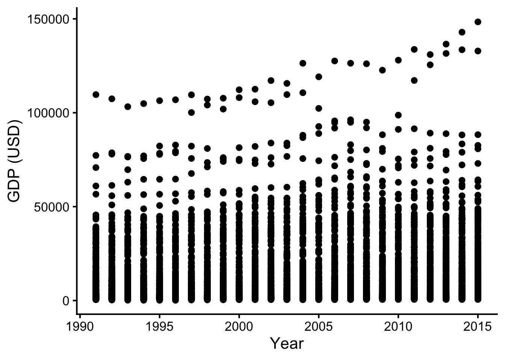

*Updated by Dr. Robert Treharne on 7 October 2026.*

This topic introduces practical tools for cleaning, manipulating, summarising,
and reshaping biological data with the `tidyverse`.

:::{important}
Complete [Topic 3](topic-3.md) before starting this chapter. You will need to
be able to read data into R, inspect data frames, and use basic `ggplot2`
plots.
:::

:::{important} Watch before the workshop
This video introduces the core ideas behind data wrangling and cleaning. Watch
it before starting the workshop material, then use the chapter to practise the
methods in R.
:::

<div style="position: relative; width: 100%; aspect-ratio: 16 / 9; margin-bottom: 2rem;">
	<iframe src="https://liverpool.cloud.panopto.eu/Panopto/Pages/Embed.aspx?id=6de60ef3-4b7e-4699-b530-b1b200cb7bc2&amp;autoplay=false&amp;offerviewer=true&amp;showtitle=true&amp;showbrand=true&amp;captions=true&amp;interactivity=all" style="border: 1px solid #464646; position: absolute; top: 0; left: 0; width: 100%; height: 100%; box-sizing: border-box;" allowfullscreen allow="autoplay" aria-label="Panopto Embedded Video Player" aria-description="Data wrangling and cleaning"></iframe>
</div>

## Files for this week

Create a `LIFE707/Topic_4` folder and download these files into it before the
workshop. They are included with this book, so you do not need to return to
Canvas.

- <a href="/data/topic-4-data-wrangling-cleaning/indicator_gapminder_gdp_per_capita_ppp.csv?download=1">indicator_gapminder_gdp_per_capita_ppp.csv</a>: Gapminder GDP-per-capita data by country and year.
- <a href="/data/topic-4-data-wrangling-cleaning/indicator_hiv_estimated_prevalence_15-49.csv?download=1">indicator_hiv_estimated_prevalence_15-49.csv</a>: estimated HIV prevalence by country and year.

It’s estimated that data scientists spend between 50-80% of their time cleaning data into a format they can use for analysis. This process is called data wrangling and is important in a world of big data. This workshop will run you through some of the key core functions for cleaning, manipulating and summarising data. We will be using the tidyverse packages tidyr and dplyr that are designed specifically to help with data wrangling.

To get started we will need to install and load `tidyverse`. Note that this will load a suite of tidyverse packages, of which we will use those detailed above.

```r
library(tidyverse)
```


## Tidy data

Hadley Wickham, who created the tidyverse, distinguishes between two types of data set: tidy and messy. This makes a distinction between a specific way of arranging data to make it useful for most R analyses.

Specifically, a tidy data set is one in which:

- rows contain different observations;
- columns contain different variables;
- cells contain values.


## 1. Simple manipulations

:::{tip} Video walkthrough
This video demonstrates the simple `tidyverse` functions used to clean and
manipulate data in this section.
:::

<div style="position: relative; width: 100%; aspect-ratio: 16 / 9; margin-bottom: 2rem;">
	<iframe src="https://liverpool.cloud.panopto.eu/Panopto/Pages/Embed.aspx?id=7f920521-c054-47ba-96f0-b1b200f04c29&amp;autoplay=false&amp;offerviewer=true&amp;showtitle=true&amp;showbrand=true&amp;captions=true&amp;interactivity=all" style="border: 1px solid #464646; position: absolute; top: 0; left: 0; width: 100%; height: 100%; box-sizing: border-box;" allowfullscreen allow="autoplay" aria-label="Panopto Embedded Video Player" aria-description="Simple tidyverse functions for cleaning data in R"></iframe>
</div>

Let’s begin by exploring the iris data set, which gives the measurements in centimeters of the variables sepal length and width, and petal length and width, respectively, for 50 flowers from each of 3 species of iris. The species are *Iris setosa, versicolor*, and *virginica*. This data set is available as part of the base R package. Let’s have a look at the data:

```r
head(iris)
```

:::{dropdown} Show expected output
```text
  Sepal.Length Sepal.Width Petal.Length Petal.Width Species
1          5.1         3.5          1.4         0.2  setosa
2          4.9         3.0          1.4         0.2  setosa
3          4.7         3.2          1.3         0.2  setosa
4          4.6         3.1          1.5         0.2  setosa
5          5.0         3.6          1.4         0.2  setosa
6          5.4         3.9          1.7         0.4  setosa
```
:::

Let’s start by looking at some basic operations, such as subsetting, sorting and adding new columns.


### 1.1 Filtering rows

One operation we often want to do is to extract a subset of rows according to some criterion. For example, we may want to extract all rows of the `iris` dataset that correspond to the `versicolor` species. In tidyverse, we can use a function called `filter()`:

```r
filter(iris, Species == "versicolor")
```

:::{dropdown} Show expected output
```text
   Sepal.Length Sepal.Width Petal.Length Petal.Width    Species
1           7.0         3.2          4.7         1.4 versicolor
2           6.4         3.2          4.5         1.5 versicolor
3           6.9         3.1          4.9         1.5 versicolor
4           5.5         2.3          4.0         1.3 versicolor
5           6.5         2.8          4.6         1.5 versicolor
6           5.7         2.8          4.5         1.3 versicolor
7           6.3         3.3          4.7         1.6 versicolor
8           4.9         2.4          3.3         1.0 versicolor
9           6.6         2.9          4.6         1.3 versicolor
10          5.2         2.7          3.9         1.4 versicolor
 [ reached 'max' / getOption("max.print") -- omitted 40 rows ]
```
:::

The first argument to the `filter()` function is the data, and the second corresponds to the criteria for filtering. Notice that we did not need to use the \$ operator in the `filter()` function. As with ggplot2 the `filter()` function knows to look for the column Species in the data set iris.


### 1.2 Sorting rows

Another common operation is to sort rows according to some criterion. Let’s try to sort rows by `Species` and then `Sepal.Length`. In tidyverse we can use the `arrange()` function.

```r
arrange(iris, Species, Sepal.Length)
```

:::{dropdown} Show expected output
```text
   Sepal.Length Sepal.Width Petal.Length Petal.Width Species
1           4.3         3.0          1.1         0.1  setosa
2           4.4         2.9          1.4         0.2  setosa
3           4.4         3.0          1.3         0.2  setosa
4           4.4         3.2          1.3         0.2  setosa
5           4.5         2.3          1.3         0.3  setosa
6           4.6         3.1          1.5         0.2  setosa
7           4.6         3.4          1.4         0.3  setosa
8           4.6         3.6          1.0         0.2  setosa
9           4.6         3.2          1.4         0.2  setosa
10          4.7         3.2          1.3         0.2  setosa
 [ reached 'max' / getOption("max.print") -- omitted 140 rows ]
```
:::

Notice once again that the first argument to `arrange()` is the data set, and then subsequent arguments are the columns that we wish to order by. Again, we do not require the \$ operator here.


### 1.3 Selecting columns

Now let’s say we want to select just the `Species`, `Sepal.Length` and `Sepal.Width` columns from the data set. In tidyverse we can use the `select()` function.

```r
select(iris, Species, Sepal.Length, Sepal.Width)
```

:::{dropdown} Show expected output
```text
   Species Sepal.Length Sepal.Width
1   setosa          5.1         3.5
2   setosa          4.9         3.0
3   setosa          4.7         3.2
4   setosa          4.6         3.1
5   setosa          5.0         3.6
6   setosa          5.4         3.9
7   setosa          4.6         3.4
8   setosa          5.0         3.4
9   setosa          4.4         2.9
10  setosa          4.9         3.1
11  setosa          5.4         3.7
12  setosa          4.8         3.4
13  setosa          4.8         3.0
14  setosa          4.3         3.0
15  setosa          5.8         4.0
16  setosa          5.7         4.4
 [ reached 'max' / getOption("max.print") -- omitted 134 rows ]
```
:::

Notice once again that the first argument to `select()` is the data set, and then subsequent arguments are the columns that we wish to select; no \$ operators required.

There is even a set of functions to help extract columns based on pattern matching e.g.

```r
select(iris, Species, starts_with("Sepal"))
```

Note that we can also remove columns using a `-` operator e.g.

```r
select(iris, -starts_with("Petal"))
```

or

```r
select(iris, -Petal.Length, -Petal.Width)
```

would remove the petal columns.


### 1.4 Adding columns

Finally, let’s add a new column called `Sepal.Length2` that contains the square of the sepal length. In tidyverse this would be:

```r
mutate(iris, Sepal.Length2 = Sepal.Length^2)
```

:::{dropdown} Show expected output
```text
  Sepal.Length Sepal.Width Petal.Length Petal.Width Species Sepal.Length2
1          5.1         3.5          1.4         0.2  setosa         26.01
2          4.9         3.0          1.4         0.2  setosa         24.01
3          4.7         3.2          1.3         0.2  setosa         22.09
4          4.6         3.1          1.5         0.2  setosa         21.16
5          5.0         3.6          1.4         0.2  setosa         25.00
6          5.4         3.9          1.7         0.4  setosa         29.16
7          4.6         3.4          1.4         0.3  setosa         21.16
8          5.0         3.4          1.5         0.2  setosa         25.00
 [ reached 'max' / getOption("max.print") -- omitted 142 rows ]
```
:::


### 1.5 Pipes

Piping comes from Unix scripting, and simply means a chain of commands, such that the results from each command feed into the next one. Recently, the `magrittr` package, and subsequently `tidyverse` have introduced the pipe operator `%>%` that enables us to chain functions together. Let’s look at an example:

```r
iris %>% filter(Species == "versicolor")
```

:::{dropdown} Show expected output
```text
   Sepal.Length Sepal.Width Petal.Length Petal.Width    Species
1           7.0         3.2          4.7         1.4 versicolor
2           6.4         3.2          4.5         1.5 versicolor
3           6.9         3.1          4.9         1.5 versicolor
4           5.5         2.3          4.0         1.3 versicolor
5           6.5         2.8          4.6         1.5 versicolor
6           5.7         2.8          4.5         1.3 versicolor
7           6.3         3.3          4.7         1.6 versicolor
8           4.9         2.4          3.3         1.0 versicolor
9           6.6         2.9          4.6         1.3 versicolor
10          5.2         2.7          3.9         1.4 versicolor
 [ reached 'max' / getOption("max.print") -- omitted 40 rows ]
```
:::

**Notice**: when we did this before we would write something like `filter(iris, Species == "versicolor")` i.e. we required the first argument of `filter()` to be a data.frame (or tibble). The pipe operator `%>%` does this automatically, so the outcome from the left-hand side of the operator is passed as the first argument to the right-hand side function. This makes the code more succinct, and easier to read (because we are not repeating pieces of code).

Pipes can be chained together multiple times. For example:

```r
#filter and just print first 6 lines
iris %>% filter(Species == "versicolor") %>% head()
```

:::{dropdown} Show expected output
```text
  Sepal.Length Sepal.Width Petal.Length Petal.Width    Species
1          7.0         3.2          4.7         1.4 versicolor
2          6.4         3.2          4.5         1.5 versicolor
3          6.9         3.1          4.9         1.5 versicolor
4          5.5         2.3          4.0         1.3 versicolor
5          6.5         2.8          4.6         1.5 versicolor
6          5.7         2.8          4.5         1.3 versicolor
```
:::

Or to run a series of sequential operations:

```r
iris %>%
    filter(Species == "versicolor") %>%
    select(Species, starts_with("Sepal")) %>%
    mutate(Sepal.Length2 = Sepal.Length^2) %>%
    arrange(Sepal.Length)
```

:::{dropdown} Show expected output
```text
      Species Sepal.Length Sepal.Width Sepal.Length2
1  versicolor          4.9         2.4         24.01
2  versicolor          5.0         2.0         25.00
3  versicolor          5.0         2.3         25.00
4  versicolor          5.1         2.5         26.01
5  versicolor          5.2         2.7         27.04
6  versicolor          5.4         3.0         29.16
7  versicolor          5.5         2.3         30.25
8  versicolor          5.5         2.4         30.25
9  versicolor          5.5         2.4         30.25
10 versicolor          5.5         2.5         30.25
11 versicolor          5.5         2.6         30.25
12 versicolor          5.6         2.9         31.36
 [ reached 'max' / getOption("max.print") -- omitted 38 rows ]
```
:::

**Notice** that the pipe operator must be at the end of the line if we wish to split the code over multiple lines.

In essence we can read what we have done in much the same way as if we were reading prose. Firstly we take the `iris` data, `filter` to extract just those rows corresponding to `versicolor` species, `select` species and sepal measurements, `mutate` the data frame to contain a new column that is the square of the sepal lengths and finally `arrange` in order of increasing sepal length.

Once we’ve got our head around pipes, we can begin to use some of the other useful functions in tidyverse to do some really useful things.


## 2. Grouping and summarising

A common thing we might want to do is to produce summaries of some variable for different subsets of the data. For example, we might want to produce an estimate of the mean of the sepal lengths for each species of iris. The `dplyr` package provides a function `group_by()` that allows us to group data, and `summarise()` that allows us to summarise data.

In this case we can think of what we want to do as “grouping” the data by `Species` and then averaging the `Sepal.Length` values within each group. Hence,

```r
iris %>% 
    group_by(Species) %>%
    summarise(mean.sepal.length = mean(Sepal.Length))
```

:::{dropdown} Show expected output
```text
# A tibble: 3 × 2
  Species    mean.sepal.length
  <fct>                  <dbl>
1 setosa                  5.01
2 versicolor              5.94
3 virginica               6.59
```
:::

The `summarise()` function (**note**, this is different to the `summary()` function), applies a function to a `data.frame` or subsets of a `data.frame`.


## 3. Reshaping data sets

Another key feature of tidyverse is the power it gives you to reshape data sets. The two key functions are `pivot_longer()` and `pivot_wider()`. The `pivot_longer()` function takes multiple columns, and gathers them into key-value pairs. The `pivot_wider()` function is its converse, it takes two columns (key and value) and spreads these into multiple columns. These ideas are best illustrated by an example.


### 3.1 Example

:::{tip} Gapminder walkthrough
This video walks through the Gapminder example before you work through the
data-cleaning steps below.
:::

<div style="position: relative; width: 100%; aspect-ratio: 16 / 9; margin-bottom: 2rem;">
	<iframe src="https://liverpool.cloud.panopto.eu/Panopto/Pages/Embed.aspx?id=93396826-12a1-4103-a172-b1b600b1c13b&amp;autoplay=false&amp;offerviewer=true&amp;showtitle=true&amp;showbrand=true&amp;captions=true&amp;interactivity=all" style="border: 1px solid #464646; position: absolute; top: 0; left: 0; width: 100%; height: 100%; box-sizing: border-box;" allowfullscreen allow="autoplay" aria-label="Panopto Embedded Video Player" aria-description="Topic 4 Gapminder example walk through"></iframe>
</div>

We will be using the Gapminder GDP per capita data that is found in the `gapminder` package, as well as online: <https://www.gapminder.org/data/>. Download the <a href="/data/topic-4-data-wrangling-cleaning/indicator_gapminder_gdp_per_capita_ppp.csv?download=1">indicator_gapminder_gdp_per_capita_ppp.csv</a> file and read the data in using the `read_csv` function in `tidyverse`. (Note that the `read_csv` function is very similar to the `read.csv` function that you’ve seen previously, but a bit more flexible in accepting column names that start with a number - a detail that will be important later.)

```r
gp_income <- read_csv("indicator_gapminder_gdp_per_capita_ppp.csv")
head(gp_income)
```

:::{dropdown} Show expected output
```text
# A tibble: 6 × 217
  `GDP per capita`      `1800` `1801` `1802` `1803` `1804` `1805` `1806` `1807`
  <chr>                  <dbl>  <dbl>  <dbl>  <dbl>  <dbl>  <dbl>  <dbl>  <dbl>
1 Abkhazia                  NA     NA     NA     NA     NA     NA     NA     NA
2 Afghanistan              603    603    603    603    603    603    603    603
3 Akrotiri and Dhekelia     NA     NA     NA     NA     NA     NA     NA     NA
4 Albania                  667    667    668    668    668    668    668    668
5 Algeria                  716    716    717    718    719    720    721    722
6 American Samoa            NA     NA     NA     NA     NA     NA     NA     NA
# ℹ 208 more variables: `1808` <dbl>, `1809` <dbl>, `1810` <dbl>, `1811` <dbl>,
#   `1812` <dbl>, `1813` <dbl>, `1814` <dbl>, `1815` <dbl>, `1816` <dbl>,
#   `1817` <dbl>, `1818` <dbl>, `1819` <dbl>, `1820` <dbl>, `1821` <dbl>,
#   `1822` <dbl>, `1823` <dbl>, `1824` <dbl>, `1825` <dbl>, `1826` <dbl>,
#   `1827` <dbl>, `1828` <dbl>, `1829` <dbl>, `1830` <dbl>, `1831` <dbl>,
#   `1832` <dbl>, `1833` <dbl>, `1834` <dbl>, `1835` <dbl>, `1836` <dbl>,
#   `1837` <dbl>, `1838` <dbl>, `1839` <dbl>, `1840` <dbl>, `1841` <dbl>, …
```
:::

Before we go any further, notice that the first column is labelled incorrectly as GDP per capita (this is an artefact from the original data set), so let’s rename the first column using the `rename()` function:

```r
#note the use of <- to replace gp_income with a new version
gp_income <- gp_income %>%
    rename(country = "GDP per capita")
head(gp_income)
```

:::{dropdown} Show expected output
```text
# A tibble: 6 × 217
  country  `1800` `1801` `1802` `1803` `1804` `1805` `1806` `1807` `1808` `1809`
  <chr>     <dbl>  <dbl>  <dbl>  <dbl>  <dbl>  <dbl>  <dbl>  <dbl>  <dbl>  <dbl>
1 Abkhazia     NA     NA     NA     NA     NA     NA     NA     NA     NA     NA
2 Afghani…    603    603    603    603    603    603    603    603    603    603
3 Akrotir…     NA     NA     NA     NA     NA     NA     NA     NA     NA     NA
4 Albania     667    667    668    668    668    668    668    668    668    668
5 Algeria     716    716    717    718    719    720    721    722    723    724
6 America…     NA     NA     NA     NA     NA     NA     NA     NA     NA     NA
# ℹ 206 more variables: `1810` <dbl>, `1811` <dbl>, `1812` <dbl>, `1813` <dbl>,
#   `1814` <dbl>, `1815` <dbl>, `1816` <dbl>, `1817` <dbl>, `1818` <dbl>,
#   `1819` <dbl>, `1820` <dbl>, `1821` <dbl>, `1822` <dbl>, `1823` <dbl>,
#   `1824` <dbl>, `1825` <dbl>, `1826` <dbl>, `1827` <dbl>, `1828` <dbl>,
#   `1829` <dbl>, `1830` <dbl>, `1831` <dbl>, `1832` <dbl>, `1833` <dbl>,
#   `1834` <dbl>, `1835` <dbl>, `1836` <dbl>, `1837` <dbl>, `1838` <dbl>,
#   `1839` <dbl>, `1840` <dbl>, `1841` <dbl>, `1842` <dbl>, `1843` <dbl>, …
```
:::

Notice that the `rename()` function takes the same form as other tidyverse functions such as `filter()` or `arrange()`. We then overwrite the original data frame to keep our workspace neat. *Note*: this is OK here because we have a copy of our raw data saved in an external file. This, combined with the use of scripts, means we have a backup of the original data in case anything goes wrong. Don’t overwrite your original data set.

Note that it is also a useful idea to avoid spaces in column names, they’re not always dealt with well by R.

The next thing we need to do is to collapse the year columns down. Ideally we want a column corresponding to country, a column corresponding to year and a final column corresponding to GDP. We are going to do this by using the `pivot_longer()` function. Note that the arguments to `pivot_longer()` are:

- `data`: this gives the name of the data frame;
- `cols`: the columns you want to collapse. Here we want to collapse everything except `country`, which we can do using the `-` operator.
- `names_to`: gives the name of the column that will contain the collapsed column names (e.g. `1800`, `1801` etc.);
- `values_to`: gives the name of the column that will contain the values in each of the cells of the collapsed column (e.g. the corresponding GDP values);

```r
gp_income <- gp_income %>%
    pivot_longer(cols = -country, names_to = "year", values_to = "gdp")
head(gp_income)
```

:::{dropdown} Show expected output
```text
# A tibble: 6 × 3
  country  year    gdp
  <chr>    <chr> <dbl>
1 Abkhazia 1800     NA
2 Abkhazia 1801     NA
3 Abkhazia 1802     NA
4 Abkhazia 1803     NA
5 Abkhazia 1804     NA
6 Abkhazia 1805     NA
```
:::

This is almost there now. Notice that R has left the new `year` column as a `character` vector, so we want to change that:

```r
gp_income <- gp_income %>%
        mutate(year = as.numeric(year))
```

Also, there is quite a lot of extraneous information in the data. Firstly, there were some mostly empty rows in Excel, which manifest as missing values when the data were read into R:

```r
table(is.na(gp_income$country))
```

:::{dropdown} Show expected output
```text

FALSE  TRUE 
56160   432
```
:::

i.e. 432 rows with country missing

We can examine these rows by filtering:

```r
gp_income %>% filter(is.na(country)) %>% summary()
```

:::{dropdown} Show expected output
```text
   country               year           gdp       
 Length:432         Min.   :1800   Min.   :36327  
 Class :character   1st Qu.:1854   1st Qu.:36327  
 Mode  :character   Median :1908   Median :36327  
                    Mean   :1908   Mean   :36327  
                    3rd Qu.:1961   3rd Qu.:36327  
                    Max.   :2015   Max.   :36327  
                                   NA's   :431
```
:::

We can see from the summary that only one row has any GDP information, and indeed in the original data there was a single additional point that could be found in cell HE263 of the original Excel file. I think this is an artefact of the original data, and as such we will remove it here using `drop_na` with the name of the column we want to drop rows that contain an NA:

```r
gp_income <- gp_income %>% drop_na(country)
```

We can also remove the rows that have no GDP information if we so wish (which are denoted by missing values—NA):

```r
gp_income <- gp_income %>% drop_na(gdp)
```

(If we use `drop_na(country, gdp)` we can drop rows where either country or gdp are NA and `drop_na()` without any arguments will drop any row that has an NA in any of the columns.)

Finally, we will restrict ourselves to looking at the data from 1990 onwards:

```r
gp_income <- gp_income %>% filter(year > 1990)
head(gp_income)
```

:::{dropdown} Show expected output
```text
# A tibble: 6 × 3
  country      year   gdp
  <chr>       <dbl> <dbl>
1 Afghanistan  1991  1022
2 Afghanistan  1992   941
3 Afghanistan  1993   810
4 Afghanistan  1994   725
5 Afghanistan  1995   872
6 Afghanistan  1996   895
```
:::

```r
summary(gp_income)
```

:::{dropdown} Show expected output
```text
   country               year           gdp        
 Length:5075        Min.   :1991   Min.   :   142  
 Class :character   1st Qu.:1997   1st Qu.:  2809  
 Mode  :character   Median :2003   Median :  8476  
                    Mean   :2003   Mean   : 15743  
                    3rd Qu.:2009   3rd Qu.: 21950  
                    Max.   :2015   Max.   :148374
```
:::

Phew! This took some effort, but we’ve managed to end up with a fairly clean data set that we can plot, summarise etc.

To do all of the previous data cleaning operation using **pipes**, we can collect up all the code above to write:

```r
gp_income <- read_csv("indicator_gapminder_gdp_per_capita_ppp.csv") %>% # reads the data in
                rename(country = "GDP per capita") %>% # renames the column "GDP per capita" to "country"
                pivot_longer(cols = -country, names_to = "year", values_to = "gdp") %>% # wide to long format
                mutate(year = as.numeric(year)) %>% # turns year as a character to year as numeric
                drop_na(country, gdp) %>% # this combines the 2 drop_na commands
                filter(year > 1990) # only give 1991 onwards

# how many rows and columns are there
dim(gp_income)
```

:::{dropdown} Show expected output
```text
[1] 5075    3
```
:::

Pipes can also be used to pass data to `ggplot`, as per Topic 2.

```r
gp_income %>% ggplot(aes(x=year,y=gdp)) + #the pipe puts data into ggplot
  geom_point() + xlab("Year") + ylab("GDP (USD)") +
  theme_classic(base_size = 16)
```



Which shows (maybe) a general upward trend in GDP but also disparity between countries. But mostly used here to show the `%>%` pipe to `ggplot`.

## Knowledge Check

Use the [LIFE707 BioBoost Knowledge Checks](https://canvas.liverpool.ac.uk/courses/93992/assignments/357982)
after working through this chapter. They will help you practise recognising
tidy data, selecting an appropriate data-wrangling operation, and following a
pipeline that reshapes and cleans data.

Attempt the questions before returning to the chapter. The results will help
you identify useful questions to bring to a workshop or drop-in session.

## Exercises

Create a new R script called `week_4_exercises.R` in your `LIFE707/Topic_4`
folder before you begin. Use it to save your code and notes as you work through
the exercises.

### Exercise 1

The built-in `iris` dataset contains measurements of sepal and petal size for
three iris species.

1. Use `group_by()` and `summarise()` to produce a table containing the mean
   and variance of sepal length and sepal width within each species.

### Exercise 2

Use the Gapminder GDP data and the HIV-prevalence data supplied at the start
of this chapter.

1. Starting with the cleaned `gp_income` dataset from the example, calculate
   mean GDP for each country across years.
2. Calculate mean GDP for each year across countries.
3. Read <a href="/data/topic-4-data-wrangling-cleaning/indicator_hiv_estimated_prevalence_15-49.csv?download=1">indicator_hiv_estimated_prevalence_15-49.csv</a> and create a tidy
   dataset called `gp_hiv` for 1991 onwards, with columns called `country`,
   `year`, and `prevalence`. Some year columns contain no values, so ensure
   that `prevalence` is numeric after cleaning.

## Exercise solutions

These solutions assume that you have already run `library(tidyverse)` and,
for Exercise 2 parts 1 and 2, created `gp_income` by following the Gapminder
example above. Run the code yourself and make sure that you understand every
line before relying on it.

:::{tip} Exercise walkthrough
Watch this walkthrough after making your own attempt at the exercises. Use it
to compare your approach with the worked solutions below.
:::

<div style="position: relative; width: 100%; aspect-ratio: 16 / 9; margin-bottom: 2rem;">
	<iframe src="https://liverpool.cloud.panopto.eu/Panopto/Pages/Embed.aspx?id=7a82816e-010b-4e45-bb48-b1b600b8c0d6&amp;autoplay=false&amp;offerviewer=true&amp;showtitle=true&amp;showbrand=true&amp;captions=true&amp;interactivity=all" style="border: 1px solid #464646; position: absolute; top: 0; left: 0; width: 100%; height: 100%; box-sizing: border-box;" allowfullscreen allow="autoplay" aria-label="Panopto Embedded Video Player" aria-description="Topic 4 task walk through"></iframe>
</div>

### Exercise 1

```r
iris %>%
  group_by(Species) %>%
  summarise(
    mnL = mean(Sepal.Length),
    varL = var(Sepal.Length),
    mnW = mean(Sepal.Width),
    varW = var(Sepal.Width)
  )
```

### Exercise 2

```r
# Mean GDP for each country across all retained years.
gp_income %>%
  group_by(country) %>%
  summarise(mn = mean(gdp))

# Mean GDP for each retained year across countries.
gp_income %>%
  group_by(year) %>%
  summarise(mn = mean(gdp))

# Create the cleaned HIV-prevalence dataset.
gp_hiv <- read_csv("indicator_hiv_estimated_prevalence_15-49.csv") %>%
  rename(country = `Estimated HIV Prevalence% - (Ages 15-49)`) %>%
  pivot_longer(cols = -country, names_to = "year", values_to = "prevalence") %>%
  mutate(year = as.numeric(year)) %>%
  drop_na(country, prevalence) %>%
  filter(year > 1990) %>%
  mutate(prevalence = as.numeric(prevalence))
```

## Getting help

Bring the exact error message, your R script, and the relevant data file to a
workshop or a drop-in session. A screenshot is useful too. Keeping each
topic's files together lets us help you find and fix problems quickly.
